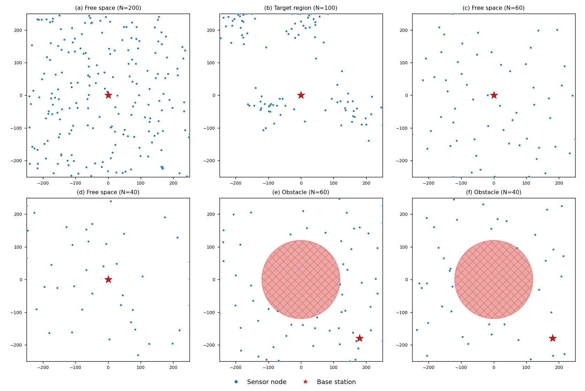

# Benchmark Documentation

This document describes the benchmarking harness used to compare GT2 against the
other WSN protocols in this repository. It covers **what scenarios** are tested,
**which metrics** are collected, **how each metric is calculated**, and **how to
run** the sweep and produce figures.

The harness is implemented in three standalone modules plus shared hooks:

| File | Role |
|------|------|
| `metrics.py` | `MetricsCollector` — algorithm-agnostic per-round measurement and scalar derivation. |
| `algos/__init__.py` | `BaseAlgorithm.run()` drives the collector; `_collect_family_metrics()` adds family extras. |
| `benchmark.py` | Parallel sweep runner over every (algorithm, deployment, seed). Writes `results/runs/*.json` + `summary.csv`. |
| `plot_benchmark.py` | Renders figures from the persisted JSON (never re-runs the sweep). |

Design rationale lives in
`docs/superpowers/specs/2026-06-01-benchmark-metrics-harness-design.md`.

---

## 1. What is benchmarked

### Algorithms

The sweep runs the set listed in `benchmark.py:ALGOS`:

```
GT2, LEACH, GTFR, DIA, MIA, TCLE,
EFTCG-1, EFTCG-2, FL-LEACH-PSO, SCA-LEVY, FC-CRA
```

(`EE-TCM` is present in `main.py` but currently commented out of the sweep
list.) These identifiers match `main.py`'s `make_algo()` selector, so the sweep
and a manual `python main.py --algo …` run instantiate identical objects.

### Deployment scenarios

Every algorithm is run across all five node-deployment scenarios defined in
`deployment.py`. Each is a pure function `(num_nodes, area, rng) -> (N, 2)`
positioning nodes in `[-area, area]²` with the base station fixed at the origin.

| Scenario | Generator | What it models | Key knob |
|----------|-----------|----------------|----------|
| **poisson** (default) | `poisson_disk` | Blue-noise: even spread with a minimum spacing (`POISSON_RADIUS=30`); shortfall topped up uniformly. Realistic well-planned deployment. | `POISSON_RADIUS` |
| **uniform** | `uniform` | Classic i.i.d. random placement — the standard WSN baseline. | — |
| **grid** | `grid` | Regular square lattice (`ceil(√N)` per axis), optional jitter. A controlled reference topology. | `GRID_JITTER` |
| **gaussian** | `gaussian_clusters` | `GAUSS_BLOBS=4` Gaussian hotspots — clustered/hotspot deployments. | `GAUSS_BLOBS`, `GAUSS_STD_FRAC` |
| **edge** | `edge_biased` | Radial density rising toward the edges (mass pushed away from the BS) — an **energy-hole stressor**. | `EDGE_EXP` |

Scenario-specific knobs are module-level constants in `deployment.py` (edited in
code); the runner only varies the universal `deployment` / `num_nodes` / `seed`.

The five scenarios, rendered with the benchmark's defaults (`N=200`,
`area=±250`, `seed=1`; base station = red star at the origin):



Regenerate this figure (and one standalone PNG per scenario,
`figures/deployment_<name>.png`) with:

```bash
conda run -n base python plot_deployments.py   # -> docs/figures/*.png
```

### Sweep dimensions (`benchmark.py` constants)

| Constant | Default | Meaning |
|----------|---------|---------|
| `DEPLOYMENTS` | the five above | scenarios swept |
| `SEEDS` | `[1, 2, 3]` | seeds per scenario (for mean ± std) |
| `NUM_NODES` | `200` | nodes per run |
| `MAX_ROUNDS` | `50000` | hard cap per run |
| `WORKERS` | `os.cpu_count()` | parallel worker processes |

This yields **11 algorithms × 5 deployments × 3 seeds = 165 runs**. A run is
fully reproducible from `(deployment, num_nodes, seed)`: a single seeded RNG in
`build_network()` drives both node positions **and** per-node `Vpre`, so results
are independent of worker count or scheduling order.

---

## 2. Metrics

Metrics follow a **universal core + family-specific extras** structure. Every
algorithm reports the same universal core (so comparisons are fair regardless of
protocol internals); clustering and topology-control algorithms each add their
own extras via `_collect_family_metrics()`.

All metrics read `NetworkModel` state only — no algorithm reimplements energy or
delivery formulas. This mirrors the project's shared-energy-model invariant.

### 2.1 Per-round series (`MetricsCollector.record_round`)

Called once per completed round from `BaseAlgorithm.run()`. For each round it
records:

| Series | How it is computed | Code |
|--------|--------------------|------|
| `rounds` | the round index `t`. | `record_round` |
| `alive` | count of sensors with `s.is_alive`. | `len(alive_sensors)` |
| `total_energy` | Σ `s.e_res` over **alive** sensors (residual energy, joules). | `sum(energies)` |
| `energy_std` | population std-dev of `s.e_res` across alive sensors (`0.0` if fewer than 2 alive). Lower = better energy balance. | `np.std(energies)` |
| `generated` | one packet per alive node ⇒ equals `alive`. | `generated = alive` |
| `delivered` | number of alive nodes that currently have a directed path to the BS. | `len(net.build_routing_tree())` |

**Delivery definition (fair, algorithm-agnostic).** A node *delivers* iff a
directed path to the base station exists on the current active topology.
`NetworkModel.build_routing_tree()` runs a reverse-BFS from the *gateway* nodes
(those within their own range `rc` of the origin) over the directed adjacency
matrix; a node is in the returned tree iff it (or a relay it reaches) connects to
the sink. So:

- `generated = alive_count`
- `delivered = len(build_routing_tree())`
- per-round PDR `= delivered / generated`

PDR stays ≈ 1.0 until the topology **partitions** or relay nodes die — that
degradation is the discriminating signal. This definition does not depend on any
algorithm's internal routing bookkeeping, which is what keeps the comparison
fair.

### 2.2 Scalar summary (`MetricsCollector.finalize`)

Derived once after the run ends. These are the columns of `summary.csv`.

| Metric | Definition | Formula in `finalize()` |
|--------|------------|--------------------------|
| **FND** (`fnd`) | First Node Death — first round where `alive < N`. | first `r` where `alive[r] < num_nodes`, else `None` |
| **HND** (`hnd`) | Half Node Death — first round where `alive ≤ N/2`. | first `r` where `alive[r] ≤ num_nodes/2`, else `None` |
| **LND** (`lnd`) | Last Node Death — final recorded round (network lifetime). | `rounds[-1]` |
| **total_delivered** | total packets reaching the BS over the whole run. | `Σ delivered` |
| **total_generated** | total packets generated over the run. | `Σ generated` |
| **mean_pdr** | mean of per-round PDR. | `mean(delivered[r]/generated[r])` over rounds with `generated>0` |
| **cumulative_pdr** | run-level delivery ratio. | `total_delivered / total_generated` |
| **energy_drained** | total energy consumed across the run (joules). | `initial_total_energy − final total_energy` |
| **energy_per_packet** | energy efficiency. | `energy_drained / total_delivered` (`None` if nothing delivered) |
| **mean_energy_std** | average energy imbalance over the run (lower = better). | `mean(energy_std)` |

`initial_total_energy` is `Σ s.e0` captured at collector construction;
`final total_energy` is the last per-round `total_energy` value.

> **Cross-check:** `metrics.fnd` should equal the algorithm's own `t_no_dead`
> (first-death round tracked independently in `BaseAlgorithm._track_death`). They
> are derived separately on purpose, so a mismatch flags a bug.

### 2.3 Clustering-family extras

For `GT2, LEACH, GTFR, FL-LEACH-PSO, SCA-LEVY, FC-CRA, EE-TCM`
(`family = 'clustering'`). Computed by `clustering_family_metrics(net)`:

| Metric | Definition |
|--------|------------|
| `ch_count` | number of cluster heads elected this round (`s.is_ch`). |
| `cluster_sizes` | list of member counts per CH (members grouped by `s.ch_belong`). Its spread (std-dev) is the **CH load-balance** indicator. |

### 2.4 Topology-family extras

For `DIA, MIA, LDIA, TCLE, EFTCG` (`family = 'topology'`). Computed by
`topology_family_metrics(net)`:

| Metric | Definition |
|--------|------------|
| `avg_degree` | mean out-degree (count of directed edges to alive nodes) over alive nodes. |
| `avg_tx_power` | mean transmit power `s.power` over alive nodes. |
| `lambda2` | left `None` here (algebraic connectivity is optional and not uniformly exposed). |

Family extras are merged into the per-round `family` dict in the time series and
read **already-computed** state only — they must not mutate the network or
trigger extra energy use.

---

## 3. Output layout

```
results/
  runs/<algo>_<deployment>_<seed>.json   # per-run: summary + time_series + metadata
  runs/<algo>_<deployment>_<seed>.log    # captured stdout of that run
  summary.csv                            # one row per run (the scalar metrics)
  summary_by_scenario.csv                # one row per (deployment, algo): mean & std
  figures/*.png                          # rendered figures
```

Each run JSON payload (`benchmark.run_one`) contains:

```json
{
  "algo": "...", "deployment": "...", "seed": N, "num_nodes": 200,
  "summary":     { ...scalar metrics... },
  "time_series": { "rounds": [...], "alive": [...], "total_energy": [...],
                   "energy_std": [...], "delivered": [...], "generated": [...],
                   "family": { ... } }
}
```

`summary.csv` columns (`benchmark.SUMMARY_FIELDS`): `algo, deployment, seed,
num_nodes, fnd, hnd, lnd, total_delivered, total_generated, mean_pdr,
cumulative_pdr, energy_drained, energy_per_packet, mean_energy_std`. This is the
**raw** table — one row per individual run, so per-scenario detail is already
present (filter by the `deployment` column).

### Figures (`plot_benchmark.py`)

| Figure | Type | Source |
|--------|------|--------|
| `survival_<deployment>.png` | line (mean ± std band across seeds) | `time_series.alive` |
| `energy_<deployment>.png` | line (mean ± std band) | `time_series.total_energy` |
| `fnd.png`, `hnd.png`, `lnd.png` | bar (mean ± std per algo, **all scenarios pooled**) | summary scalars |
| `delivered.png` | bar (pooled) | `total_delivered` |
| `pdr.png` | bar (pooled) | `cumulative_pdr` |
| `energy_per_packet.png` | bar (pooled) | `energy_per_packet` |

Curves across runs of differing length are aligned by padding the shorter
series with its last value (`_aligned_mean_std`), so a network that dies early
holds its final value rather than dropping to zero.

### Per-scenario metrics

The plain `fnd.png` / `hnd.png` / … bar charts average each metric over **all
five deployments**, so they show only a single pooled mean per algorithm. To see
how a metric varies **across scenarios**, use either of these (both produced by
the same `plot_benchmark.py` run):

| Output | What it gives |
|--------|---------------|
| `figures/<metric>_by_scenario.png` | grouped bar chart — one bar group per algorithm, one coloured bar per deployment (mean ± std across seeds). Metrics: `fnd`, `hnd`, `lnd`, `total_delivered`, `cumulative_pdr`, `energy_per_packet`. |
| `summary_by_scenario.csv` | one row per `(deployment, algo)` with `<metric>_mean` and `<metric>_std` columns (aggregated across seeds) — the numeric form of the same breakdown. |

For example, `lnd_by_scenario.png` makes FL-LEACH-PSO's near-constant LND across
all five deployments immediately visible (flat bars of equal height), versus
FC-CRA's scenario-dependent spread.

To read a single algorithm's per-scenario numbers directly from the CSV:

```bash
# every scenario's FND/HND/LND mean for one algorithm
awk -F, 'NR==1 || $2=="GT2"' results/summary_by_scenario.csv | \
  cut -d, -f1-2,4,6,8
```

---

## 4. Usage

### Prerequisites

Activate the conda `base` environment (see `CLAUDE.md`). Packages: `numpy scipy
matplotlib networkx pyyaml`.

### Run the sweep

```bash
conda run -n base python benchmark.py
```

- Dispatches all `(algo, deployment, seed)` combinations across `WORKERS`
  processes (CPU-bound runs ⇒ processes, not threads).
- Writes one `results/runs/<algo>_<deployment>_<seed>.json` per run, then
  rebuilds `results/summary.csv` from all run files once the pool drains.
- **Resumable & idempotent:** an existing run JSON is skipped, so a crashed or
  partial sweep is resumed simply by re-running. Safe to launch in the
  background (DIA is slow — ~140k better-response steps to converge — but now
  overlaps with the other runs).
- Plotting inside algorithms is no-op'd (`_disable_plotting`) and `MPLBACKEND` is
  forced to `Agg`, so no windows open and no figures leak.

### Render figures

```bash
conda run -n base python plot_benchmark.py
```

Reads `results/runs/*.json` and writes `results/figures/*.png` plus
`results/summary_by_scenario.csv`. It **never** re-runs the sweep, so you can
iterate on plots cheaply. This emits both the pooled bar charts and the
per-scenario breakdown (`<metric>_by_scenario.png` + the CSV).

### Render the deployment-scenario figures

```bash
conda run -n base python plot_deployments.py
```

Writes `docs/figures/deployments.png` (all five scenarios) and
`docs/figures/deployment_<name>.png` (one per scenario). Independent of the
sweep — it only needs `deployment.py`.

### Tuning the sweep

Edit the constants at the top of `benchmark.py`:

- `ALGOS` — add/remove algorithm keys (must match `main.py`'s selector).
- `DEPLOYMENTS` — subset the scenarios.
- `SEEDS` — more seeds → tighter mean ± std bands (more runs).
- `NUM_NODES`, `MAX_ROUNDS`, `WORKERS` — scale, run length, parallelism. Set
  `WORKERS = 1` to force sequential execution for debugging.

To re-run a specific combination, delete its `results/runs/<...>.json` and
re-run `benchmark.py` — only the missing files are regenerated.

### Single manual run (for debugging metrics)

The same metrics are collected by any normal run, so you can inspect them
without the sweep:

```python
from main import build_network, make_algo
net = build_network('poisson', 200, seed=1)
algo = make_algo('GT2', net, dict(max_rounds=3, plot_period=10**9))
algo.run()
print(algo.metrics.summary())      # scalar metrics
print(algo.metrics.time_series())  # per-round series
```
