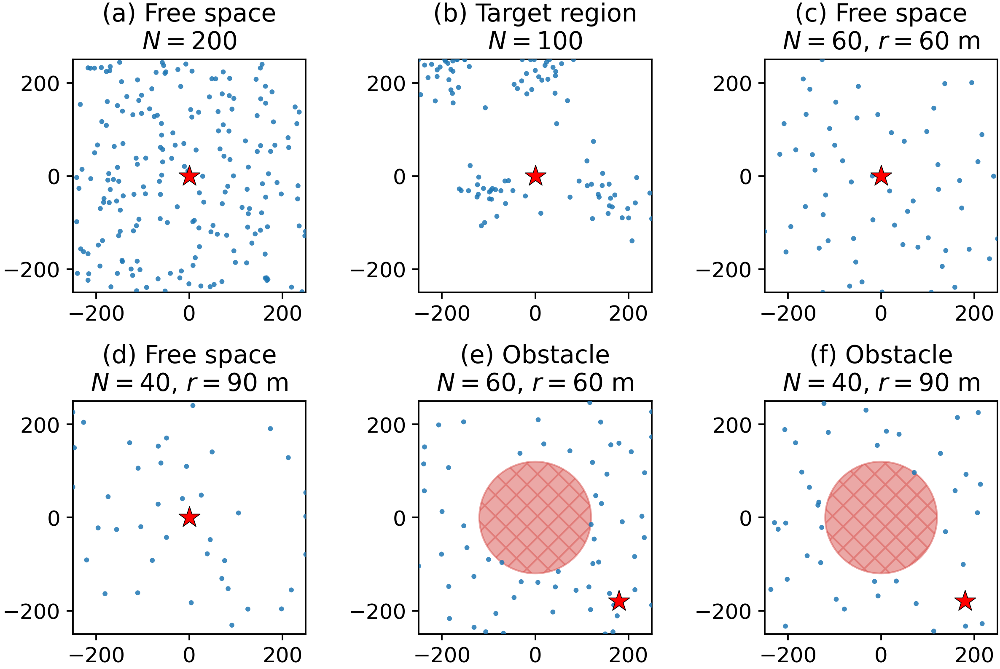

# Benchmark Documentation

This document describes the benchmarking harness used to compare GT2 against the
other WSN protocols in this repository. It covers **what scenarios** are tested,
**how scenarios are produced and frozen**, **which metrics** are collected, **how
each metric is calculated**, and **how to run** the sweep and produce figures.

The harness is implemented in a handful of standalone modules plus shared hooks:

| File | Role |
|------|------|
| `scenarios/store.py` | `save_scenario` / `load_scenario` — the frozen-CSV format (positions + Vpre + BS). |
| `scenarios/freeze_scenarios.py` | Snapshot the five random `deployment.py` generators to `scenarios/gen/*.csv`. |
| `scenarios/freeze_coverage_scenarios.py` | Snapshot the four coverage-PSO deployments to `scenarios/gen/*.csv`. |
| `scenarios/make_coverage_scenario.py` | Build a coverage scenario CSV from a region-definition YAML. |
| `scenarios/coverage_deploy.py` | Projected-PSO placement (maximise coverage s.t. BS connectivity). |
| `scenarios/regions.py` | `Region` — shapely geometry (bounds − obstacles, path corridors). |
| `metrics.py` | `MetricsCollector` — algorithm-agnostic per-round measurement and scalar derivation. |
| `algos/__init__.py` | `BaseAlgorithm.run()` drives the collector; `_collect_family_metrics()` adds family extras. |
| `benchmark.py` | Parallel sweep over every (algorithm, scenario tag, seed). Writes `results/runs/*.json` + `summary.csv`. |
| `plot_benchmark.py` | Renders figures from the persisted JSON (never re-runs the sweep). |
| `plot_eval_scenarios.py` | Renders the six evaluation deployments as one 2×3 panel figure. |

Design rationale lives in
`docs/superpowers/specs/2026-06-01-benchmark-metrics-harness-design.md` (metrics)
and `docs/superpowers/specs/2026-06-10-scenario-persistence-and-coverage-deployment-design.md`
(frozen scenarios + coverage deployment).

---

## 1. What is benchmarked

### Algorithms

The sweep runs the set listed in `benchmark.py:ALGOS`:

```
GT2, LEACH, GTFR, DIA, MIA, TCLE,
EFTCG-1, EFTCG-2, FL-LEACH-PSO, SCA-LEVY, FC-CRA
```

(`EE-TCM` is present in `main.py` but currently commented out of the sweep
list.) These identifiers match `main.py`'s `make_algo()` selector, so the sweep
and a manual `python main.py --algo …` run instantiate identical objects.

### Deployment scenarios — frozen CSVs, not live generators

The benchmark **consumes frozen scenario files**, not the live `deployment.py`
generators. Each scenario is a CSV under `scenarios/gen/` produced once and read
back at run time, so a sweep reads a fixed file instead of regenerating
positions. This makes runs reproducible regardless of generator code changes and
lets random baselines and bespoke coverage layouts share one load path.

A frozen scenario stores node positions, per-node `Vpre`, the base-station
position, and provenance metadata (`scenarios/store.py`):

```
# gt-tc-scenario v1
# source=uniform num_nodes=200 seed=1 area=250 coverage_radius= bs_x=0.0 bs_y=0.0
x,y,vpre
5.910812350128367,225.23184816296765,4.120733683866358
...
```

`build_network(scenario=<path>)` (in `main.py`) loads such a file, skips
generation, and places the BS where the CSV says (it may be **off-centre**). If
the scenario declares a `coverage_radius`, every node starts at the transmit
power whose comm range equals that radius, so the network is BS-connected from
round 0; scenarios without one keep the `P_MAX/4` default.

The sweep grid (`benchmark.py:SCENARIOS`) is **six** frozen tags — two random
baselines plus four coverage-PSO deployments:

| Tag | Kind | N | What it models |
|-----|------|---|----------------|
| `uniform_n200` | random baseline | 200 | i.i.d. uniform placement, BS at origin — the classic WSN baseline. |
| `gaussian_n100` | random baseline | 100 | Gaussian hotspots, BS at origin — clustered/target-region deployment. |
| `cov_free_n40_r90` | coverage PSO, free space | 40 | Coverage-maximising layout, 90 m coverage radius, BS at origin. |
| `cov_free_n60_r60` | coverage PSO, free space | 60 | Coverage-maximising layout, 60 m coverage radius, BS at origin. |
| `cov_obs_n40_r90` | coverage PSO, obstacle | 40 | Central circular obstacle (r=120 m), off-centre BS at (180, −180), 90 m coverage radius. |
| `cov_obs_n60_r60` | coverage PSO, obstacle | 60 | Central circular obstacle (r=120 m), off-centre BS at (180, −180), 60 m coverage radius. |

The tag is what lands in the `deployment` column of every metric, so plots and
`summary_by_scenario.csv` group by it automatically. Node count is parsed from
the tag's `_n<N>` token (`benchmark.nodes_for`); the seed selects the file
`scenarios/gen/<tag>_s<seed>.csv`.

The six evaluation scenarios, one representative instance each (seed 1; BS = red
star, obstacle = hatched circle):



Render this 2×3 panel with:

```bash
conda run -n base python plot_eval_scenarios.py   # -> docs/figures/deployment_scenarios.png
```

### How scenarios are produced and frozen

Frozen CSVs come from one of two producers, both writing to `scenarios/gen/`:

**Random baselines** — `scenarios/freeze_scenarios.py` snapshots the five
`deployment.py` generators (`poisson`, `uniform`, `grid`, `gaussian`, `edge`)
via `build_network`, so the frozen layout reflects the *feasibility-resampled*
network the sweep would have run. One CSV per (deployment, seed):

```bash
conda run -n base python -m scenarios.freeze_scenarios
```

The sweep only references `uniform_n200` and `gaussian_n100` from this set, but
all five are frozen for documentation/comparison.

**Coverage-PSO deployments** — `scenarios/coverage_deploy.place_nodes` runs a
**projected particle-swarm** placement: decision variables are the `2N` node
coordinates; particles are warm-started inside the deployable area and projected
back into it after every update (so they never leave the feasible region);
fitness = covered-target fraction − `λ`·disconnected-fraction. A final
connectivity-repair pass snaps any still-disconnected node toward the BS
component, guaranteeing a benchmark-ready (BS-connected) layout. The deployable
area is a `Region` (`scenarios/regions.py`): the square bounds minus obstacle
polygons/circles, optionally restricted to buffered path corridors, built from a
plain dict. PSO knobs live in `config/coverage.yaml` (`pso_particles`,
`pso_iters`, `pso_w/c1/c2`, `penalty_lambda`, `target_spacing`).

> **Coverage radius vs. physics comm range.** The scenario's `coverage_radius`
> is a *design-time* quantity used only for placement (a target is covered, and
> two nodes/BS are connected, within that radius). The benchmark's physical comm
> range is still the fixed `P_MIN..P_MAX` mapping in `NetworkModel`; the shared
> energy model is untouched. `build_network` validates every frozen layout
> against the real `check_potential_connectivity()` and raises if it is not
> connectable.

The four sweep coverage deployments are frozen (10 seeds each, in parallel —
each seed is an independent PSO placement) with:

```bash
conda run -n base python -m scenarios.freeze_coverage_scenarios
```

A bespoke coverage scenario can be built from a region-definition YAML
(`scenarios/defs/*.yaml`) — obstacles, circles, paths, off-centre BS, and a
scalar or list of seeds:

```bash
conda run -n base python -m scenarios.make_coverage_scenario --def scenarios/defs/example.yaml
# seed list in the def -> one CSV per seed, scenarios/gen/<name>_s<seed>.csv
# scalar seed          -> a single scenarios/gen/<name>.csv
```

### Sweep dimensions (`benchmark.py` constants)

| Constant | Default | Meaning |
|----------|---------|---------|
| `SCENARIOS` | the six tags above | frozen scenario tags swept |
| `SEEDS` | `[1, 2, 3, 4, 5, 6, 7, 8, 9, 42]` | seeds per scenario (for mean ± std) |
| `NUM_NODES` | `200` | fallback only when a tag has no `_n<N>` token |
| `SCENARIO_DIR` | `scenarios/gen` | where frozen CSVs are read from |
| `MAX_ROUNDS` | `50000` | hard cap per run |
| `WORKERS` | `48` | parallel worker processes |

This yields **11 algorithms × 6 scenarios × 10 seeds = 660 runs**. Each run loads
`scenarios/gen/<tag>_s<seed>.csv`; if that file is missing, `run_one` raises
(generate the frozen scenarios first). Because positions, `Vpre`, and the BS all
come from disk, a run is fully reproducible and independent of worker count or
scheduling order.

---

## 2. Metrics

Metrics follow a **universal core + family-specific extras** structure. Every
algorithm reports the same universal core (so comparisons are fair regardless of
protocol internals); clustering and topology-control algorithms each add their
own extras via `_collect_family_metrics()`.

All metrics read `NetworkModel` state only — no algorithm reimplements energy or
delivery formulas. This mirrors the project's shared-energy-model invariant.

### 2.1 Per-round series (`MetricsCollector.record_round`)

Called once per completed round from `BaseAlgorithm.run()`. For each round it
records:

| Series | How it is computed | Code |
|--------|--------------------|------|
| `rounds` | the round index `t`. | `record_round` |
| `alive` | count of sensors with `s.is_alive`. | `len(alive_sensors)` |
| `total_energy` | Σ `s.e_res` over **alive** sensors (residual energy, joules). | `sum(energies)` |
| `energy_std` | population std-dev of `s.e_res` across alive sensors (`0.0` if fewer than 2 alive). Lower = better energy balance. | `np.std(energies)` |
| `generated` | one packet per alive node ⇒ equals `alive`. | `generated = alive` |
| `delivered` | number of alive nodes that currently have a directed path to the BS. | `len(net.build_routing_tree())` |
| `avg_hop` | mean depth over delivered nodes in the routing tree, **+1** for the final hop to the BS (a gateway has depth 0 = one hop to the sink). `0.0` if nothing reaches the BS. | `mean(depth)+1` |
| `avg_tx_power` | mean transmit power `s.power` over alive nodes (universal core, computed here). | `mean(s.power)` |

**Delivery definition (fair, algorithm-agnostic).** A node *delivers* iff a
directed path to the base station exists on the current active topology.
`NetworkModel.build_routing_tree()` runs a reverse-BFS from the *gateway* nodes
(those within their own range `rc` of the BS) over the directed adjacency
matrix; a node is in the returned tree iff it (or a relay it reaches) connects to
the sink. So:

- `generated = alive_count`
- `delivered = len(build_routing_tree())`
- per-round PDR `= delivered / generated`

PDR stays ≈ 1.0 until the topology **partitions** or relay nodes die — that
degradation is the discriminating signal. The routing tree's per-node `depth`
also drives `avg_hop` (path length to the sink). Neither definition depends on
any algorithm's internal routing bookkeeping, which is what keeps the comparison
fair.

### 2.2 Scalar summary (`MetricsCollector.finalize`)

Derived once after the run ends. These are the columns of `summary.csv`.

| Metric | Definition | Formula in `finalize()` |
|--------|------------|--------------------------|
| **FND** (`fnd`) | First Node Death — first round where `alive < N`. | first `r` where `alive[r] < num_nodes`, else `None` |
| **HND** (`hnd`) | Half Node Death — first round where `alive ≤ N/2`. | first `r` where `alive[r] ≤ num_nodes/2`, else `None` |
| **LND** (`lnd`) | Last Node Death — final recorded round (network lifetime). | `rounds[-1]` |
| **total_delivered** | total packets reaching the BS over the whole run. | `Σ delivered` |
| **total_generated** | total packets generated over the run. | `Σ generated` |
| **mean_pdr** | mean of per-round PDR. | `mean(delivered[r]/generated[r])` over rounds with `generated>0` |
| **cumulative_pdr** | run-level delivery ratio. | `total_delivered / total_generated` |
| **energy_drained** | total energy consumed across the run (joules). | `initial_total_energy − final total_energy` |
| **energy_per_packet** | energy efficiency. | `energy_drained / total_delivered` (`None` if nothing delivered) |
| **mean_energy_std** | average energy imbalance over the run (lower = better). | `mean(energy_std)` |
| **mean_avg_hop** | average hop count to the BS over the run. | `mean(avg_hop)` |
| **mean_avg_tx_power** | average per-node transmit power over the run. | `mean(avg_tx_power)` |

`initial_total_energy` is `Σ s.e0` captured at collector construction;
`final total_energy` is the last per-round `total_energy` value.

> **Cross-check:** `metrics.fnd` should equal the algorithm's own `t_no_dead`
> (first-death round tracked independently in `BaseAlgorithm._track_death`). They
> are derived separately on purpose, so a mismatch flags a bug.

### 2.3 Clustering-family extras

For `GT2, LEACH, GTFR, FL-LEACH-PSO, SCA-LEVY, FC-CRA, EE-TCM`
(`family = 'clustering'`). Computed by `clustering_family_metrics(net)`:

| Metric | Definition |
|--------|------------|
| `ch_count` | number of cluster heads elected this round (`s.is_ch`). |
| `cluster_sizes` | list of member counts per CH (members grouped by `s.ch_belong`). Its spread (std-dev) is the **CH load-balance** indicator. |

### 2.4 Topology-family extras

For `DIA, MIA, LDIA, TCLE, EFTCG` (`family = 'topology'`). Computed by
`topology_family_metrics(net)`:

| Metric | Definition |
|--------|------------|
| `avg_degree` | mean out-degree (count of directed edges to alive nodes) over alive nodes. |
| `lambda2` | left `None` here (algebraic connectivity is optional and not uniformly exposed). |

> `avg_tx_power` used to be a topology-family extra; it is now a **universal-core**
> per-round series (every algorithm reports it), so it is no longer duplicated
> here.

Family extras are merged into the per-round `family` dict in the time series and
read **already-computed** state only — they must not mutate the network or
trigger extra energy use.

---

## 3. Output layout

```
results/
  runs/<algo>_<tag>_<seed>.json   # per-run: summary + time_series + metadata
  runs/<algo>_<tag>_<seed>.log    # captured stdout of that run
  summary.csv                     # one row per run (the scalar metrics)
  summary_by_scenario.csv         # one row per (deployment, algo): mean & std
  figures/*.png                   # rendered figures
```

Each run JSON payload (`benchmark.run_one`) contains:

```json
{
  "algo": "...", "deployment": "<tag>", "seed": N, "num_nodes": 200,
  "summary":     { ...scalar metrics... },
  "time_series": { "rounds": [...], "alive": [...], "total_energy": [...],
                   "energy_std": [...], "delivered": [...], "generated": [...],
                   "avg_hop": [...], "avg_tx_power": [...], "family": { ... } }
}
```

`summary.csv` columns (`benchmark.SUMMARY_FIELDS`): `algo, deployment, seed,
num_nodes, fnd, hnd, lnd, total_delivered, total_generated, mean_pdr,
cumulative_pdr, energy_drained, energy_per_packet, mean_energy_std, mean_avg_hop,
mean_avg_tx_power`. This is the **raw** table — one row per individual run, so
per-scenario detail is already present (filter by the `deployment` column).

### Figures (`plot_benchmark.py`)

Per-scenario time-series curves (mean ± std band across seeds):

| Figure | Source series |
|--------|---------------|
| `survival_<tag>.png` | `alive` |
| `energy_<tag>.png` | `total_energy` |
| `hop_<tag>.png` | `avg_hop` |
| `tx_power_<tag>.png` | `avg_tx_power` |
| `ch_count_<tag>.png` | family `ch_count` (clustering algos only) |

Pooled bar charts (mean ± std per algo, **all scenarios pooled**):

| Figure | Source |
|--------|--------|
| `fnd.png`, `hnd.png`, `lnd.png` | summary scalars |
| `delivered.png` | `total_delivered` |
| `pdr.png` | `cumulative_pdr` |
| `energy_per_packet.png` | `energy_per_packet` |

Curves across runs of differing length are aligned by padding the shorter
series with its last value (`_aligned_mean_std`), so a network that dies early
holds its final value rather than dropping to zero.

### Per-scenario breakdown

The pooled bar charts average each metric over **all six scenarios**, showing
only a single mean per algorithm. To see how a metric varies **across
scenarios**, use either of these (both produced by the same `plot_benchmark.py`
run):

| Output | What it gives |
|--------|---------------|
| `figures/<metric>_by_scenario.png` | grouped bar chart — one bar group per algorithm, one coloured bar per scenario (mean ± std across seeds). Metrics: `fnd`, `hnd`, `lnd`, `total_delivered`, `cumulative_pdr`, `energy_per_packet`, `mean_avg_hop`, `mean_avg_tx_power`. |
| `summary_by_scenario.csv` | one row per `(deployment, algo)` with `<metric>_mean` / `<metric>_std` for each of those eight metrics, plus `n_seeds` and `energy_per_packet_median` — the numeric form of the same breakdown. |

To read a single algorithm's per-scenario numbers directly from the CSV:

```bash
# every scenario's FND/HND/LND mean for one algorithm
awk -F, 'NR==1 || $2=="GT2"' results/summary_by_scenario.csv | \
  cut -d, -f1-2,4,6,8
```

---

## 4. Usage

### Prerequisites

Activate the conda `base` environment (see `CLAUDE.md`). Packages: `numpy scipy
matplotlib networkx pyyaml` plus `shapely` for the coverage generator.

### Step 0 — freeze the scenarios (one-time)

The sweep reads frozen CSVs and will raise if any are missing, so generate them
first:

```bash
conda run -n base python -m scenarios.freeze_scenarios            # random baselines
conda run -n base python -m scenarios.freeze_coverage_scenarios   # coverage-PSO deployments
```

Both are idempotent — existing CSVs are skipped, so re-running only fills gaps.
To regenerate a scenario, delete its `scenarios/gen/<tag>_s<seed>.csv` and re-run.

### Run the sweep

```bash
conda run -n base python benchmark.py
```

- Dispatches all `(algo, tag, seed)` combinations across `WORKERS` processes
  (CPU-bound runs ⇒ processes, not threads).
- Writes one `results/runs/<algo>_<tag>_<seed>.json` per run, then rebuilds
  `results/summary.csv` from all run files once the pool drains.
- **Resumable & idempotent:** an existing run JSON is skipped, so a crashed or
  partial sweep is resumed simply by re-running. Safe to launch in the
  background (DIA is slow — ~140k better-response steps to converge — but now
  overlaps with the other runs).
- Plotting inside algorithms is no-op'd (`_disable_plotting`) and `MPLBACKEND` is
  forced to `Agg`, so no windows open and no figures leak.

### Render figures

```bash
conda run -n base python plot_benchmark.py
```

Reads `results/runs/*.json` and writes `results/figures/*.png` plus
`results/summary_by_scenario.csv`. It **never** re-runs the sweep, so you can
iterate on plots cheaply. This emits the per-scenario time-series curves, the
pooled bar charts, and the per-scenario breakdown (`<metric>_by_scenario.png` +
the CSV).

### Render the scenario figures

```bash
conda run -n base python plot_eval_scenarios.py   # the six evaluation scenarios (2x3 panel)
conda run -n base python plot_deployments.py      # the five random baselines (one PNG each)
```

`plot_eval_scenarios.py` writes `docs/figures/deployment_scenarios.png` from the
frozen CSVs. `plot_deployments.py` renders the random `deployment.py` baselines
(and can draw a single custom scenario with `--def`/`--scenario`, including the
deployable area, obstacles, paths, coverage disks, and an off-centre BS).

### Tuning the sweep

Edit the constants at the top of `benchmark.py`:

- `ALGOS` — add/remove algorithm keys (must match `main.py`'s selector).
- `SCENARIOS` — subset/extend the frozen scenario tags (each must have frozen
  CSVs for every seed).
- `SEEDS` — more seeds → tighter mean ± std bands (more runs).
- `MAX_ROUNDS`, `WORKERS` — run length, parallelism. Set `WORKERS = 1` to force
  sequential execution for debugging.

To re-run a specific combination, delete its `results/runs/<...>.json` and
re-run `benchmark.py` — only the missing files are regenerated.

### Single manual run (for debugging metrics)

The same metrics are collected by any normal run, so you can inspect them
without the sweep:

```python
from main import build_network, make_algo
net = build_network(scenario='scenarios/gen/uniform_n200_s1.csv')
algo = make_algo('GT2', net, dict(max_rounds=3, plot_period=10**9))
algo.run()
print(algo.metrics.summary())      # scalar metrics
print(algo.metrics.time_series())  # per-round series
```
