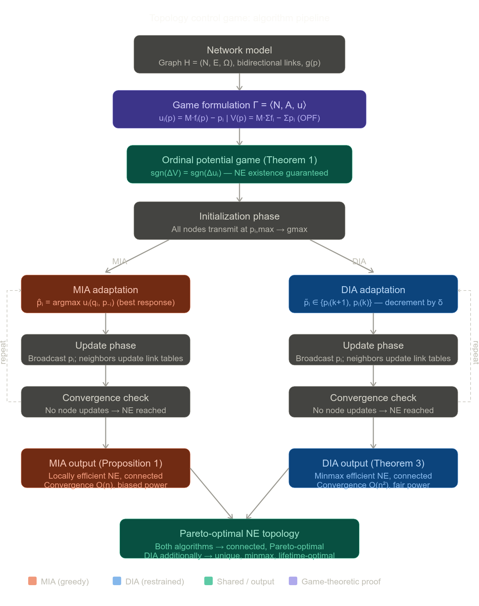

# Summary: The Topology Control Game — MIA and DIA (Komali, MacKenzie & Gilles, 2008)

## 1. Problem Formulation and Network Model

The paper addresses **topology control (TC)** in wireless ad hoc networks under *selfish node behavior* (Sections 1–3). The network is modeled as a graph $H = (N, E, \Omega)$, where $N = \{1, \ldots, n\}$ is the set of nodes, $E \subseteq N^2$ is the edge set, and $\Omega = [\omega_{ij}]$ is the matrix of edge weights, with $\omega(i,j)$ denoting the minimum power required to close link $(i,j)$. A bidirectional link $(i,j)$ exists if and only if $\min\{p_i, p_j\} \geq \max\{\omega(i,j), \omega(j,i)\}$. The **link state variable** is defined as:

$$l_{ij}(p_i) = \begin{cases} 1 & \text{if } p_i \geq \omega(i,j) \\ 0 & \text{otherwise} \end{cases}$$

The joint transmit power profile $\mathbf{p} = (p_1, \ldots, p_n)$ induces the topology:

$$g(\mathbf{p}) = \{ij \mid l_{ij}(p_i) \cdot l_{ji}(p_j) = 1,\ i \neq j \in N\}$$

The TC objective is to derive a subgraph $g_p \subseteq g_{\max}$ that is both **energy-efficient** and **connected** (Section 3.1).

## 2. Game-Theoretic Formulation

Each node $i$ is a player with action space $A_i = [0, p_{i,\max}]$ and a utility function capturing the tradeoff between connectivity benefit and transmission cost (Section 3.2):

$$u_i(\mathbf{p}) = M \cdot f_i(\mathbf{p}) - p_i \quad \text{(Equation 9)}$$

where $f_i(\mathbf{p})$ is the number of nodes reachable from $i$ via bidirectional paths (possibly over multiple hops), and $M = \max_i\{p_{i,\max}\}$ is the benefit multiplier.

**Theorem 1** establishes that this TC game $\bar{\Gamma} = \langle N, A, u \rangle$ is an **Ordinal Potential Game (OPG)** with ordinal potential function:

$$V(\mathbf{p}) = M \sum_{i \in N} f_i(\mathbf{p}) - \sum_{i \in N} p_i \quad \text{(Equation 10)}$$

This is proven by showing $\text{sgn}(\Delta V) = \text{sgn}(\Delta u_i)$ for any unilateral deviation by node $i$. A key consequence (**Theorem 2**) is that the global potential maximizers coincide *exactly* with topologies that are globally energy-efficient — connected and minimizing $\sum_i p_i$.

## 3. Algorithm Structure: Common Phases

Both proposed algorithms — **MIA** (Max-Improvement Algorithm) and **DIA** ($\delta$-Improvement Algorithm) — share a three-phase structure (Section 4):

1. **Initialization:** All nodes transmit at $p_{i,\max}$, inducing $g_{\max}$.
2. **Adaptation:** Nodes update sequentially (round-robin or random), adjusting power according to either a best-response (MIA) or a better-response (DIA) rule.
3. **Update:** Each adapting node broadcasts its new power level; all neighbors update their link-state tables accordingly.

## 4. MIA: Max-Improvement Algorithm

Under MIA, each node $i$, when selected, performs a **greedy best-response** by solving (Section 4.2.1):

$$\hat{p}_i = \arg\max_{q_i \in A_i} u_i(q_i, \mathbf{p}_{-i}) \quad \text{(Equation 6)}$$

**Proposition 1** states that MIA converges to an NE that is **locally energy-efficient** and preserves connectivity. The proof shows that disconnecting the network is never a best response, since $M \cdot (n - k_i) \geq p_{i,\max}$ for any $k_i < n$, making a utility-improving disconnection impossible. Because connectivity is preserved at every step, $f_i(\mathbf{p}) = n$ throughout, reducing each node's problem to pure power minimization.

MIA converges in exactly $n$ steps (**Proposition 3**, convergence rate $O(n)$), but its greedy "first-mover advantage" leads to **suboptimal and unfair** power distributions — nodes updating earlier seize lower power levels, forcing later-updating nodes to transmit at higher power to maintain connectivity.

## 5. DIA: $\delta$-Improvement Algorithm

DIA employs a **restrained better-response** strategy. The action space is discretized into a finite ordered set (Section 4.2.2):

$$\tilde{A}_i = \{p^{(0)} = p_{\max},\ p^{(1)},\ \ldots,\ p^{(\ell)} = p_{\min}\}$$

where $p^{(k)} < p^{(k-1)}$ and step size $\delta$ is chosen to satisfy **Assumption 2**: at most one link is dropped per adaptation step. Each node $i$ chooses:

$$\tilde{p}_i = \arg\max_{q_i \in \{p_i^{(k+1)},\ p_i^{(k)}\}} u_i(q_i, \mathbf{p}_{-i}) \quad \text{(Equation 8)}$$

That is, the node decrements its power by one level only if it strictly improves utility; otherwise it holds its current level.

The central theoretical result (**Theorem 3**) proves that DIA converges to a **minmax energy-efficient topology** — one that minimizes $\max_i p_i$. The proof proceeds via two lemmas:

- **Lemma 2:** Starting from $g_{\max}$, DIA converges to a subgraph $g_{\text{dia}}$ of the **Power-based Minimum Spanning Tree (PMST)** — the MST augmented by any additional edges induced by the wireless broadcast property.
- **Lemma 3:** The MST minimizes the maximum edge weight, shown by contradiction: any alternative spanning tree $T$ with a lower maximum edge weight can be used to construct a new tree with lower total weight than the MST, which is a contradiction.

Since PMST contains MST and no induced edge increases the maximum edge weight, $g_{\text{dia}} \subseteq \text{PMST}$ inherits the minmax optimality. DIA also produces a **unique** steady-state power assignment (**Proposition 2**), given distinct edge weights. Its convergence rate is $O(n^2)$ (**Proposition 4**), and every NE produced is **Pareto-optimal** (**Theorem 4**).

## 6. Comparative Properties

| Property | MIA | DIA |
|---|---|---|
| Response type | Greedy best-response | Restrained better-response |
| Energy efficiency | Local only | Minmax (global) |
| Fairness | Biased (first-mover advantage) | Even distribution |
| Convergence rate | $O(n)$ | $O(n^2)$ |
| NE uniqueness | Order-dependent | Unique (Proposition 2) |
| Pareto optimality | Yes | Yes |

A mixed scenario where a fraction $q$ of nodes uses MIA and $(1-q)$ uses DIA produces NE topologies whose efficiency degrades monotonically as $q$ increases — corroborating that DIA's restraint is responsible for its superior global performance.

## 7. Localized Extension: LDIA

A localized variant (**LDIA**) is sketched in Section 5.5.2 using a $k$-hop neighborhood utility:

$$\tilde{u}_i^{(k)}(\mathbf{p}) = M \cdot f_i^{(k)}(\mathbf{p}) - p_i \quad \text{(Equation 16)}$$

where $f_i^{(k)}$ counts nodes reachable within $k$ hops. By broadcasting only to $k$-hop neighbors rather than the entire network, LDIA reduces message complexity from $O(n^2)$ to a bounded overhead independent of $n$.

## Algorithmic pipeline

The pipeline above traces the full structure of the paper. A few points on how to read it:
The purple and teal boxes at the top correspond to the game-theoretic scaffolding — the potential game proof is foundational, since it simultaneously guarantees NE existence, convergence of both algorithms, and the identification of globally optimal states as potential maximizers. The two branches split at the Initialization phase and reconverge only at the Pareto-optimality result, reflecting that MIA and DIA share the three-phase structure but differ fundamentally in what equilibria they select.
The key tension the paper navigates is that **greedy best-response (MIA)** is fast ($O(n)$) but order-dependent and locally optimal only, whereas
**restrained better-response (DIA)** is slower ($O(n^2)$) but provably converges to the minmax global optimum regardless of update order — a consequence of the PMST-subgraph characterization in Lemma 2 and the MST minmax property in Lemma 3.