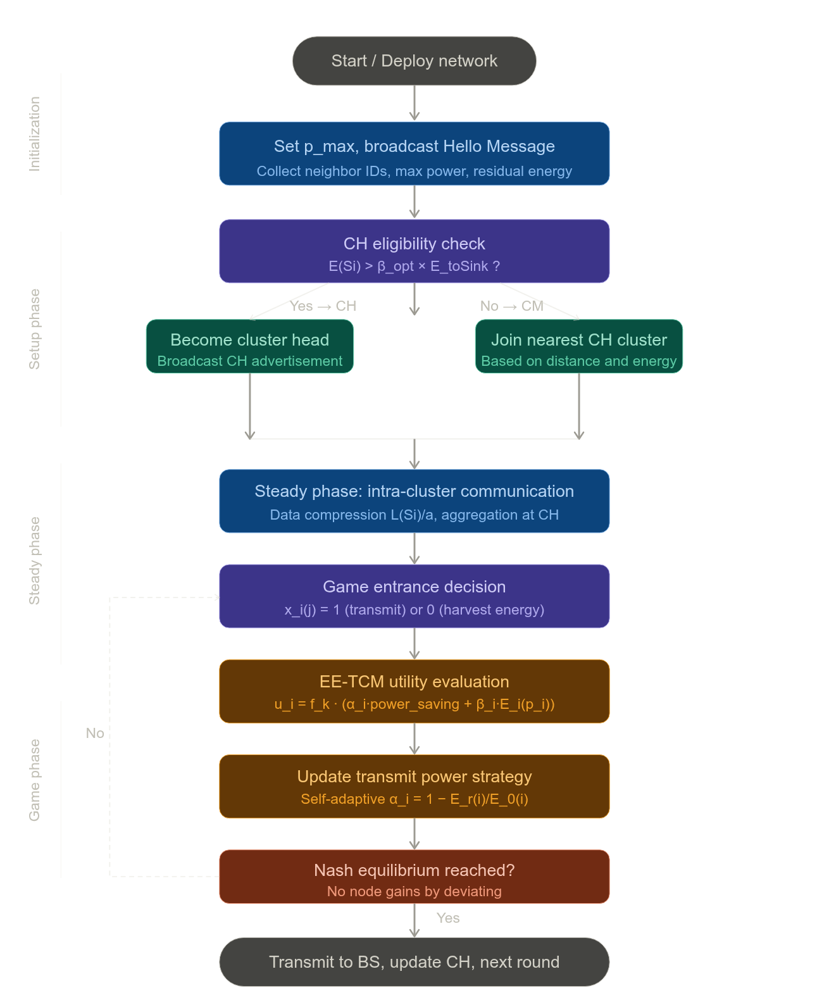

# EE-TCM: Energy-Efficiency Topology Control Model for WSNs

**Elavarasan & Rajaram, *Sustainable Computing: Informatics and Systems*, 44 (2024) 101015**

---

## 1. Problem Statement and Motivation

The paper addresses the dual challenge of energy balance and energy consumption minimization in wireless sensor networks (WSNs). Battery-powered sensor nodes have finite lifespans, and uneven energy depletion across the network causes premature node death, which disrupts connectivity and data forwarding. The authors observe that conventional clustering approaches allow nodes to behave selfishly — refusing cluster head (CH) roles — which leads to suboptimal energy distribution. The proposed solution, the **Energy-Efficiency Topology Control Model (EE-TCM)**, applies non-cooperative game theory and a welfare-based utility metric to incentivize cooperative energy behavior in a distributed, decentralized manner. *(§1 Introduction, §1.1 Contributions)*

---

## 2. Network and Energy Consumption Model

*(§3.1–3.2)*

The WSN is modeled as an undirected graph $G(N, E)$, where $N = \{1, 2, \ldots, n\}$ is the set of sensor nodes and $E \subseteq N \times N$ is the set of bidirectional links. Each link $(i, j)$ requires a minimum transmit power $p_{i,j}$ to remain active. A power profile $p = (p_1, p_2, \ldots, p_n)$ with $p_i \in [0, p_i^{\max}]$ determines the active edge set $E'$.

Energy consumption per node comprises four components:

**Sensing energy:**
$$E_S = L(S_i) \times V_{dc} \times I(S_i) \times T(S_i)$$

**Processing energy:**
$$E_P = L(S_i) \times \frac{V_{dc}}{8} \times (I_{Write} \times T_{Write} + I_{Read} \times T_{Read})$$

**Transmission energy** (distance-dependent dual model):
$$E_{Ti} = \begin{cases} L(S_i) \cdot E_{elec} + L(S_i) \cdot E_{fs} \cdot d^2, & d < d_0 \\ L(S_i) \cdot E_{elec} + L(S_i) \cdot E_{mp} \cdot d^4, & d \geq d_0 \end{cases}$$

where $d_0 = \sqrt{E_{fs}/E_{mp}}$ is the free-space/multipath crossover distance.

**Reception energy:**
$$E_{Ri} = L(S_i) \times E_{elec}$$

**Total energy consumption:**
$$C = E_S + E_P + E_{Ti} + E_{Ri}$$

---

## 3. Non-Cooperative Game Model

*(§3.3)*

The game is formally defined as $\Gamma \langle N, S, \{u_i\} \rangle$, where:
- $N = \{1, 2, \ldots, n\}$ is the set of sensor nodes (players),
- $S = \times_{i=1}^n S_i$ is the joint strategy space, and
- $\{u_i\}$ is the set of utility functions mapping strategies to real-valued payoffs.

A strategy profile $s^* = (s_i^*, s_{-i}^*)$ constitutes a **Nash Equilibrium (NE)** if:
$$u_i(s^*) \geq u_i(s_i, s_{-i}^*), \quad \forall i \in N, \forall s_i \in S_i$$

The authors further show that the game is an **ordinal potential game**, possessing a potential function $V : S \to \mathbb{R}$ such that:
$$V(p_l, s_{-i}) - V(q_l, s_{-i}) > 0 \iff u_l(p_l, s_{-l}) - u_l(q_l, s_{-l}) > 0$$

This guarantees the existence of a unique NE, and the NE is shown to be **Pareto optimal** — no node can improve its energy situation without worsening another's. *(§3.3)*

---

## 4. Distributed Clustering Model

*(§3.4)*

The protocol operates in rounds, each divided into two phases:

**Setup Phase:** Cluster formation and CH selection occur based on residual energy. A node $S_i$ qualifies to become a CH if:
$$E(S_i) > \beta_{opt} \times E_{toSink}$$
where:
$$\beta_{opt} = \frac{(r_{max} - r)}{r_{max}} \times \frac{E_{toSink}}{E_0(S_i)}$$

Here $E(S_i)$ is the node's residual energy, $E_{toSink}$ is the energy cost to communicate with the base station, $r$ is the current round, and $r_{max}$ is the maximum number of rounds (i.e., the network lifetime).

Non-CH nodes join the cluster of the nearest CH with sufficient energy. CHs are updated each round epoch.

**Steady Phase:** Intra-cluster communication, data aggregation, and game-theoretic entrance decisions are carried out. To reduce memory and transmission overhead, data messages of $L(S_i)$ bits are compressed by a factor $a$. The energy savings from compression are:
$$E_{saving_i} = \left[1 - \frac{1}{a}\right] \cdot [E_P + E_T + E_R] - E_{compress}$$

---

## 5. Topology Control Game Model (EE-TCM)

*(§3.5)*

The topology control game $T\langle N, S, \{u_i\} \rangle$ assigns each node a binary strategy $x_i(j) \in \{0, 1\}$: entering the game (transmitting, $x_i(j) = 1$) or staying out (harvesting energy, $x_i(j) = 0$).

The cluster-level game is:
$$G_i = \{N_i, M_j, X_i(j)_{j \in N_i}, U_i(j)_{j \in N_i}\}$$

The utility function for sensor node $j$ in cluster $i$ is:
$$U_i(x_i(j)) = \begin{cases} g_i(j) - C_i(j), & \text{if } x_i(j) = 1 \text{ and } \exists x_i(k) = 0 \\ g_i(j) + f_i(j), & \text{if } x_i(j) = 0 \text{ for all } j \in M_j \\ 0, & \text{if } x_i(j) = 1 \end{cases}$$

where $g_i(j)$ is the node's residual energy, $C_i(j)$ is the transmission cost, and $f_i(j)$ is the harvested energy. Nodes adopt a **mixed strategy**, entering the game with probability $P_i(j)$. The expected utility under mixed strategies is:

$$E[U_i(x_i(j))] = P_i(j)(g_i(j) - C_i(j)) + (1 - P_i(j))(g_i(j) + f_i(j)) \times \left(1 - \prod_{k \neq j}^{M_j}(1 - P_i(k))\right)$$

The two-factor utility function for topology control maps transmit power to node benefit:
$$u_i(p_i, p_{-i}) = f_k(p_i, p_{-i}) \left( \alpha_i \frac{p_i^{max} - p_i}{p_i^{max}} + \beta_i E_i(p_i) \right)$$

where $f_k(p_i, p_{-i})$ is a monotonic connectivity indicator (1 if the network remains $k$-connected, 0 otherwise), and $E_i(p_i) = \frac{1}{m}\sum_{j=1}^{m} \frac{E_r(j)}{E_0(j)}$ is the average normalized residual energy of node $i$'s one-hop neighbors.

The weights $\alpha_i$ and $\beta_i$ are **self-adaptive**, computed from the node's own energy state:
$$\alpha_i = 1 - \frac{E_r(i)}{E_0(i)}, \quad \beta_i = 1 - \alpha_i$$

As a node's energy depletes, $\alpha_i$ increases and $\beta_i$ decreases, causing the node to reduce its transmit power to preserve lifetime. This self-adaptive mechanism removes the need for fixed weights used in prior work. *(§3.5)*

The algorithm has **O(n) complexity**: the information collection phase involves $3n$ total data transfers, and the game phase adds $m(2n + n)$ operations for convergence, where $m \ll n$ is the number of neighbors per node. *(§3.5)*

---

## 6. Simulation and Results

*(§4)*

Simulations were conducted in NS-2 over a 1000×1000 m² area with 50–150 nodes, each initialized with 5 J of energy. Transmit power ranged from $10^{-5}$ to 5 W, with energy parameters $c_1 = 50$ nJ/bit, $c_2 = 100$ pJ/bit/m², and path loss exponent $r = 3.5$.

The proposed EE-TCM was compared against two baselines — TCM and GA-TC — across varying node counts on the metric of **connected probability ratio**. At 50 nodes, EE-TCM achieved 94% connectivity versus 76% (TCM) and 86% (GA-TC). At 100 nodes, the gap widened to 96% vs. 78% and 89%, respectively. At 150 nodes, EE-TCM reached 99% — demonstrating superior scalability. *(§4, Tables 3–5)*

---

## 7. Key Contributions and Limitations

*(§5–6)*

The primary contribution is the integration of a welfare-based, self-adaptive utility function into a non-cooperative game-theoretic framework for distributed topology control. The mixed-strategy Nash equilibrium guarantees stable, Pareto-optimal energy distribution without centralized coordination. Compared to fixed-weight approaches in prior literature, the self-adaptive $\alpha_i$ / $\beta_i$ weights allow each node to autonomously calibrate between power reduction and neighbor energy preservation.

The authors acknowledge limitations including scalability challenges in very large deployments, the need for careful calibration of utility weights in highly dynamic environments, and the requirement for broader testing across varied network topologies. Future work is directed toward incorporating additional QoS metrics such as reliability and robustness into the game-theoretic framework. *(§5–6)*

## 8. Algorithm pipeline

