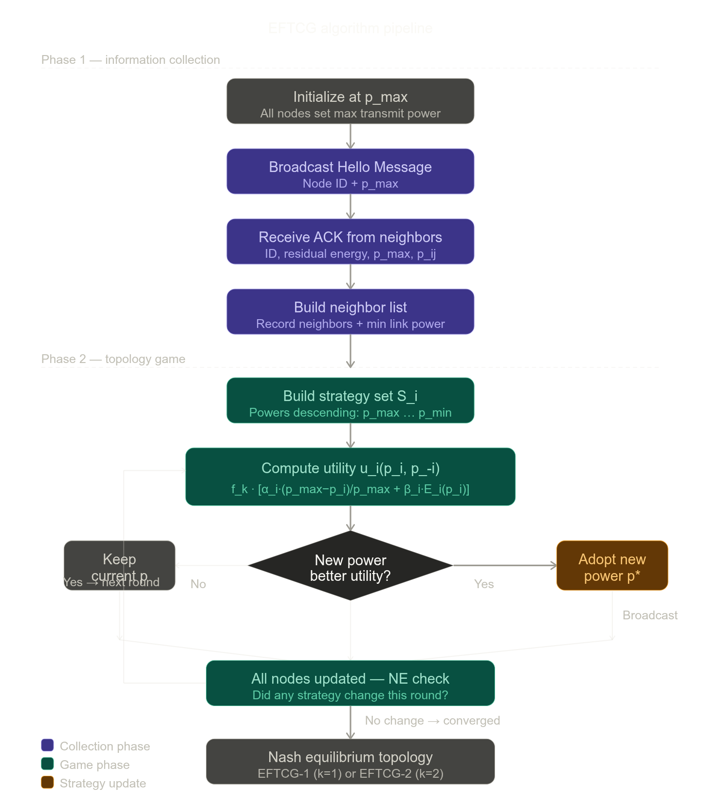

# EFTCG — Energy-Efficient and Fault-Tolerant Topology Control Game Algorithm

## 1. Problem Formulation and Network Model

*(Source: Section 2.1, pp. 3–4)*

The wireless sensor network is modeled as an undirected graph $G(N, E)$, where $N = \{1, 2, \ldots, n\}$ is the set of sensor nodes and $E \subseteq N \times N$ is the set of bidirectional communication links. Each node $i$ has an adjustable transmit power $p_i \in [0, p_i^{\max}]$, and $p_{i,j}$ denotes the minimum power required to sustain link $(i,j)$. The maximum-power network $G^{\max}(N, E^{\max})$, where $E^{\max} = \{(i,j) \mid p_i^{\max} \geq p_{i,j},\ p_j^{\max} \geq p_{j,i}\}$, defines the set of all feasible links. The objective is to find a subgraph $G' \subseteq G^{\max}$ that is simultaneously energy-efficient and fault-tolerant.

Two connectivity properties are central: a graph is **single connected** ($k=1$) if any two nodes have at least one path between them, and **biconnected** ($k=2$) if it is single connected and contains no cut-points — nodes whose removal would disconnect the network. Cut-points are identified via Depth-First Search (DFS) using the recurrence:

$$\text{low}(v) = \begin{cases} \min\{\text{low}(v),\ \text{low}(w)\} & \text{(I: tree edge)} \\ \min\{\text{low}(v),\ \text{time}(w)\} & \text{(II: back edge, } w \text{ not parent of } v\text{)} \end{cases}$$

where $\text{time}(v)$ is the DFS discovery timestamp of $v$, and $\text{low}(v)$ is the earliest ancestor reachable from the subtree of $v$ without passing through its parent. A non-root node $v$ is a cut-point if $\text{low}(w) \geq \text{time}(v)$ for any child $w$.

---

## 2. Utility Function Design

*(Source: Section 3.2, pp. 6–7)*

Each sensor node acts as a self-interested player. The utility function $u_i(p_i, p_{-i})$ is designed to balance three factors — transmit power, residual energy, and network connectivity:

$$u_i(p_i, p_{-i}) = f_k(p_i, p_{-i}) \left[ \alpha_i \frac{p_i^{\max} - p_i}{p_i^{\max}} + \beta_i E_i(p_i) \right]$$

where:
- $f_k(p_i, p_{-i}) \in \{0, 1\}$ is the $k$-connectivity indicator (1 if the network remains $k$-connected under the current power profile, 0 otherwise). This term ensures that reducing power does not violate connectivity.
- $\frac{p_i^{\max} - p_i}{p_i^{\max}}$ is the normalized power saving term; maximizing it means minimizing transmit power.
- $E_i(p_i) = \frac{1}{m} \sum_{j=1}^{m} \frac{E_r(j)}{E_o(j)}$ is the average normalized residual energy ratio of node $i$'s one-hop neighbors reachable at power $p_i$, where $m$ is the neighbor count, $E_r(j)$ is the residual energy, and $E_o(j)$ is the initial energy of neighbor $j$.
- The weights $\alpha_i$ and $\beta_i = 1 - \alpha_i$ are **self-adaptive**: $\alpha_i = 1 - \frac{E_r(i)}{E_o(i)}$. As node $i$'s own energy depletes, $\alpha_i$ increases, making the node prioritize power reduction over neighbor energy; when energy is ample, the node may increase power to select neighbors with higher residual energy.

---

## 3. Game-Theoretic Model and Convergence

*(Source: Section 3.1–3.3, pp. 5–9)*

The topology control problem is formulated as a non-cooperative game $\mathcal{T}\langle N, S, \{u_i\} \rangle$ where:
- **Players**: all $n$ sensor nodes.
- **Strategy space**: $S_i = \{p^{\max} = p_1, p_2, \ldots, p_m = p^{\min}\}$, the set of feasible transmit powers for node $i$, ordered descending by the minimum power required to reach each neighbor.
- **Utility function**: $u_i$ as defined above.

**Theorem 2** establishes that this game is an **ordinal potential game** with potential function:

$$V(p_i, p_{-i}) = \sum_{i \in N} f_k^i(p_i, p_{-i}) \left[ \alpha_i \frac{p_i^{\max} - p_i}{p_i^{\max}} + \beta_i E_i(p_i) \right]$$

The proof shows that for any unilateral deviation by node $i$ from strategy $p_i$ to $q_i$, the sign of $\Delta V = V(p_i, \cdot) - V(q_i, \cdot)$ is always consistent with the sign of $\Delta u_i = u_i(p_i, \cdot) - u_i(q_i, \cdot)$, satisfying the ordinal potential game definition.

**Theorem 3** guarantees that a **Nash Equilibrium (NE)** always exists: since each node's strategy set is finite, a strategy combination maximizing $V$ always exists and is, by Theorem 1, a Nash Equilibrium.

---

## 4. Algorithm: EFTCG (with Subalgorithms EFTCG-1 and EFTCG-2)

*(Source: Section 4, pp. 9–10)*

The algorithm operates in two sequential phases.

**Phase 1 — Topology Information Collection:**
Each node initializes at $p_i^{\max}$ and broadcasts a "Hello Message" containing its node ID and maximum transmit power. Upon receiving ACK responses from neighbors, each node records neighbor IDs, residual energies, maximum powers, and the minimum link power $p_{i,j}$, constructing a neighbor list. This phase involves $3n$ message exchanges.

**Phase 2 — Topology Game:**
Based on the neighbor list, each node constructs its strategy set $S_i$ in descending power order. The game proceeds in sequential rounds; in each round, nodes update their strategies one at a time (ordered by node ID), using the **better response strategy**:

$$s_{i,r+1} = \arg\max_{s_i \in \{s_{i,r},\ s_i^{(r+1)}\}} u_i(s_i, s_{-i})$$

That is, node $i$ adopts a new power only if it yields strictly higher utility than the current strategy. A node that improves its strategy broadcasts the updated power to inform other nodes. The game terminates when no node updates its strategy in a complete round — the resulting profile is a Nash Equilibrium.

The two subalgorithms differ only in the connectivity constraint embedded in $f_k$:
- **EFTCG-1**: $k=1$ (single connectivity), prioritizes energy efficiency.
- **EFTCG-2**: $k=2$ (biconnectivity), adds redundant links to eliminate cut-points and improve fault tolerance, at the cost of slightly higher transmit power and modestly reduced network lifetime.

**Complexity**: The total complexity of EFTCG is $O(n)$, where the collection phase requires $3n$ exchanges and the game phase requires at most $m(3n)$ exchanges ($m$ = maximum number of neighbors), which is linear in $n$ since $m \ll n$.

---

## 5. Fault-Tolerance Metrics

*(Source: Section 5.2, pp. 14–15)*

Three metrics are defined to evaluate fault tolerance after $n_f$ nodes fail:

- **Rate of survival nodes**: $R_s = \frac{n - n_f - n_u}{n} \times 100\%$, where $n_u$ is the count of nodes rendered unavailable due to network partition.
- **Rate of connectable node pairs**: $R_{cnp} = \frac{1}{n(n-1)} \sum_{i \in N_s} \sum_{j > i} l_{ij} \times 100\%$, where $l_{ij} = 1$ if nodes $i$ and $j$ remain communicable.
- **Average node degree**: $D = \frac{1}{n}\sum_{i=1}^n d_i$, where $d_i = \sum_{j \neq i} l_{ij}$.

---

## 6. Simulation Results Summary

*(Source: Section 5, pp. 11–18)*

EFTCG-1, compared against DIA, MLPT, and DEBA, achieves the lowest standard deviation of residual energy over time, indicating superior energy balance. It delivers lower average transmit power than MLPT and DEBA (though marginally higher than DIA, which solely minimizes power without balancing energy). Network lifetime is comparable to DIA while EFTCG operates at significantly lower complexity ($O(n)$ vs. $O(n^2)$ for DIA). EFTCG-2, relative to EFTCG-1, increases the average node degree by 60.49%, the survival node rate by 36.34%, and the connectable node pair rate by 69.70%, while reducing network lifetime by only 4.4%.

## Algorithm pipeline

