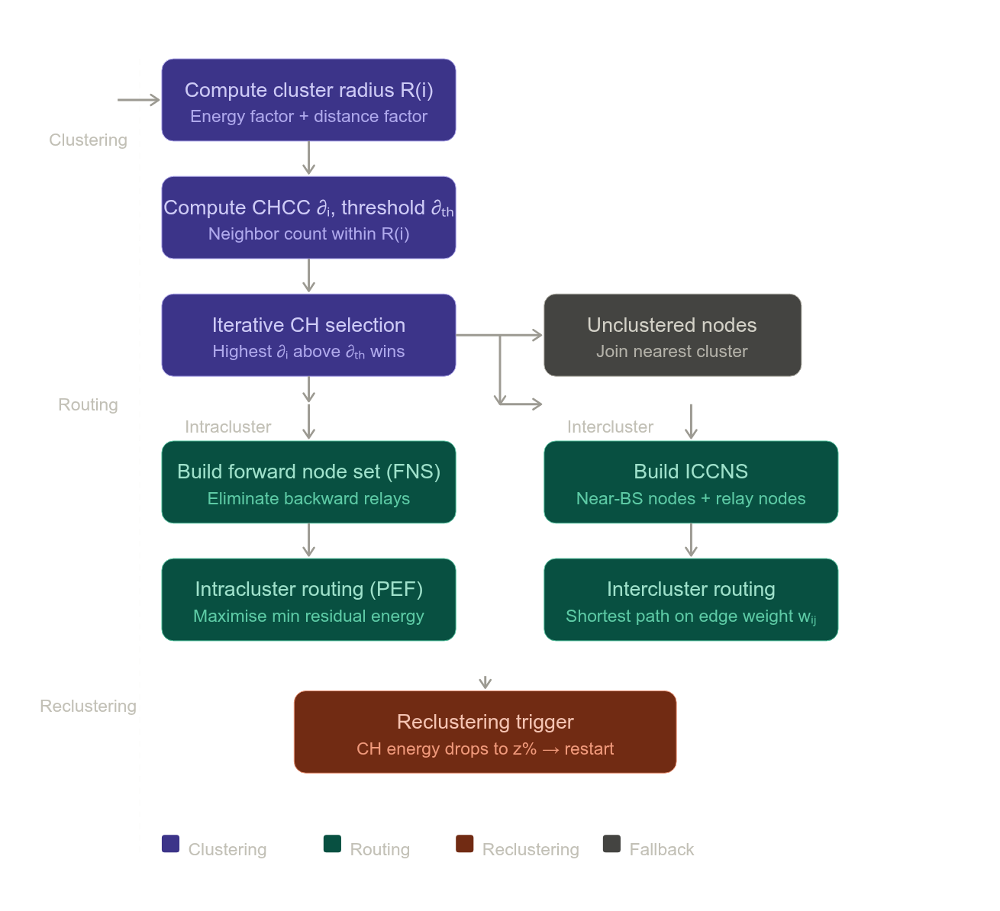

# FC-CRA: Clustering and Routing Algorithm for Fast Changes of Large-Scale WSN in IoT

> Fan, B., & Xin, Y. (2024). A Clustering and Routing Algorithm for Fast Changes of Large-Scale WSN in IoT. *IEEE Internet of Things Journal*, 11(3), 5036–5049.

---

## 1. Problem Context and Motivation

*(From Section I: Introduction)*

Wireless sensor networks (WSNs) in large-scale IoT deployments face two interconnected challenges: fast changes in node energy and fast changes in node distribution caused by node death. Classical protocols such as LEACH rely on single-hop communication, which causes distant nodes to consume energy rapidly and die prematurely. Multihop communication alleviates this but introduces the "energy hole" problem — near-base-station (near-BS) nodes become overloaded by relaying data from farther regions and die early, disrupting network continuity. Existing algorithms fail to simultaneously adapt cluster size, intracluster routing, and intercluster routing to the dynamic state of a large-scale WSN. The FC-CRA is proposed to address this gap.

---

## 2. Network and Energy Model

*(From Section III: System Model)*

The network consists of member nodes, relay nodes, and cluster heads (CHs) distributed uniformly in a circular monitoring area. A fixed BS lies within this area. TDMA communication is adopted. All nodes are homogeneous and GPS-equipped, and transmission power adjusts to communication distance. The energy model follows the first-order radio model:

**Transmission energy:**

$$E_{TX}(l, d) = \begin{cases} l(E_{elec} + \varepsilon_{fs}d^2), & d < d_0 \\ l(E_{elec} + \varepsilon_{mp}d^4), & d \geq d_0 \end{cases}$$

**Reception energy:**

$$E_{RX}(l) = lE_{elec}$$

**Data aggregation at CH:**

$$E_{DA}(l) = lE_{da}$$

The distance threshold $d_0 = \sqrt{\varepsilon_{fs}/\varepsilon_{mp}}$ separates free-space from multipath propagation regimes.

---

## 3. Algorithm Overview

*(From Section IV-A)*

The FC-CRA operates in two phases — **clustering** and **routing** — and triggers reclustering when any CH's residual energy drops to $z\%$ of its energy at the time of last cluster construction.

**Pipeline:**

---

## 4. Clustering Phase: Adaptive Cluster Radius

*(From Section IV-B)*

The cluster radius of candidate CH node $i$ is defined as:

$$R(i) = (1 + \beta_i)\alpha_i R_0$$

where the three components serve distinct roles:

**Energy–distance balance factor** $\beta_i$:

$$\beta_i = D_E \frac{f_E(i)}{f_{E_{max}}} + (1 - D_E)f_D(i)$$

The energy dispersion coefficient $D_E$ (equation 14) quantifies the relative spread of residual energies across all alive nodes $N_a$. When energy is heterogeneously distributed, $f_E(i)$ (the energy factor, equation 5) dominates — nodes with more energy form larger clusters. When energies are similar, $f_D(i)$ (the distance factor, equation 6) takes precedence — near-BS nodes are given smaller cluster radii to prevent them from accumulating excessive forwarding load.

The energy factor $f_E(i)$ is zero for any node below the median residual energy $E_{th}$, ensuring low-energy nodes are excluded from CH candidacy. The distance factor $f_D(i)$ is zero for nodes within the maximum single-hop distance (MSHD) $d_{max} = 1.2d_0$, preventing nodes very close to the BS (which already enjoy short-distance communication) from forming large clusters that would overload them.

**Energy Dispersion Coefficient $D_E$**:

$$D_E = \frac{\sum_{i \in N_a}(E(i) - E_{ave})^2}{(E_{max} - E_{min})^2 |N_a|}$$

$D_E$ measures how **heterogeneous** the residual energies are across the network. The numerator is the total squared deviation from the mean (sum of squared differences), while the denominator normalises by the maximum possible spread squared times the number of nodes, bounding $D_E \in [0, 1]$.

- When nodes have **similar residual energies** (early network life or after successful balancing), $D_E \approx 0$, and $\beta_i \approx f_D(i)$ — the distance factor dominates. This makes sense: when energy is uniform, node location becomes the primary differentiator for CH suitability.
- When energies are **highly heterogeneous** (late network life, some nodes nearly dead), $D_E \approx 1$, and $\beta_i \approx f_E(i)/f_{E_{max}}$ — the energy factor dominates. This ensures that only energy-rich nodes form large clusters when resources are scarce.

**Energy Factor $f_E(i)$**

$$f_E(i) = \begin{cases} \frac{E(i)}{E_{th}}, & E(i) \geq E_{th} \\ 0, & E(i) < E_{th} \end{cases}$$

This factor is **zero for any node below the median energy**, acting as a hard gate that prevents low-energy nodes from becoming CHs at all. For nodes above $E_{th}$, $f_E(i)$ scales linearly with residual energy: a node with twice the median energy gets twice the energy factor. Normalised by $f_{E_{max}}$ in $\beta_i$, this becomes a relative score among eligible CH candidates.

**Distance Factor $f_D(i)$**

$$f_D(i) = \begin{cases} 0, & i \in S_1 \\ \frac{1}{2}\left(1- \cos\frac{d_{iBS} - d_{max}}{R_m - d_{max}}\pi \right), & i \in S_2 \end{cases}$$

where $S_1$ is the region within $d_{max}$ of the BS, and $S_2$ is everything beyond.

Nodes in $S_1$ (very close to BS) receive $f_D(i) = 0$, giving them no distance-based boost to cluster radius. This is deliberate: near-BS nodes already face heavy intercluster forwarding load, so they should form small clusters to conserve energy for relay duties. Giving them a large cluster radius would worsen the energy hole.

For nodes in $S_2$, $f_D(i)$ follows a cosine curve that rises smoothly from 0 at $d_{iBS} = d_{max}$ to 1 at $d_{iBS} = R_m$ (the network boundary). This means far-BS nodes get the largest distance-based boost, encouraging them to form larger clusters. The cosine shape ensures a smooth, gradual transition rather than an abrupt step, avoiding instability near the boundary between $S_1$ and $S_2$.

**Datum cluster radius** $R_0$:

$$R_0 = \sqrt{\frac{R_m^2 E_{th}}{|N_a| P E_0}}$$

This is the **network-wide baseline** radius — a single value shared by all nodes at a given round. It answers the question: *given the current network state, what is the "average" appropriate cluster radius?*

Each term plays a specific role:

- $R_m$ is the radius of the entire monitoring area. $R_m^2$ appears because cluster area scales with the square of radius — the formula is essentially normalising cluster area relative to monitoring area.
- $P$ is the target fraction of nodes that should become CHs (e.g., $P = 0.05$ means 5% of nodes are CHs). The expected number of clusters is $P \cdot |N_a|$, and each cluster should cover $1/(P \cdot |N_a|)$ of the total area.
- $E_{th}$ is the **median** residual energy of all alive nodes $N_a$. As the network ages and nodes lose energy, $E_{th}$ falls, causing $R_0$ to shrink. This is the mechanism by which the algorithm **automatically contracts cluster sizes** as the network degrades — fewer alive nodes and lower median energy both reduce $R_0$.
- $E_0$ is the initial node energy, used to normalise $E_{th}$ into a dimensionless ratio.

Intuitively, $R_0$ shrinks over time as $E_{th} \downarrow$ and $|N_a| \downarrow$, reflecting the fact that a degraded network should form smaller, more manageable clusters.

**Local density correction** $\alpha_i$:

$$\alpha_i = \sqrt{\frac{1}{P N_0(i)}}$$

where $N_0(i)$ is the number of alive nodes within radius $R_0$ centred at node $i$.

$R_0$ is a network-average quantity and does not account for **local node density**. In a region where nodes are densely packed, using $R_0$ as the cluster radius would create enormous clusters with too many members, placing excessive processing and aggregation load on the CH. In a sparse region, it might not capture enough nodes to justify the overhead of forming a cluster at all.

$\alpha_i$ corrects for this. The expected number of nodes in a circle of radius $R_0$ under uniform distribution is approximately $P N_0(i)$ clusters worth of nodes. If $N_0(i)$ is large (dense region), $\alpha_i < 1$ and $R_0$ is scaled down, shrinking the cluster. If $N_0(i)$ is small (sparse region), $\alpha_i > 1$ and $R_0$ is scaled up, expanding the cluster to capture enough members. The square root keeps the correction proportional to radius rather than area.

The combined base radius $\alpha_i R_0$ therefore represents the **locally-corrected baseline** before any energy or distance consideration.

**CH selection** is an iterative process. In each iteration, the node with the highest cluster head competition coefficient (CHCC) $\partial_i = |h_i|$ (cardinality of its neighbor set within $R(i)$) that exceeds the average threshold $\partial_{th}$ is selected as a CH and forms a cluster. Marked (clustered) nodes are removed from subsequent iterations. Any remaining unclustered nodes after all iterations join their nearest cluster.

---

## 5. Intracluster Routing: Path Energy Function

*(From Section IV-C)*

To avoid energetically wasteful backward transmission in multihop intracluster paths, the forward node set (FNS) $FN_i$ for node $i$ is defined geometrically as all nodes $j$ satisfying:

$$d_{ij}^2 + d_{jC_g}^2 \leq d_{iC_g}^2$$

Only nodes within this "forward cone" toward the CH $C_g$ are eligible relay candidates.

The path energy function (PEF) $F(i, j, l)$ is a recursive quantity that computes the minimum residual energy (MRE) along the path from node $i$ to $C_g$, given that $j$ is the next hop:

$$F(i, j, l) = \begin{cases} \min\{\lambda(i,j,l),\ F(j, NH_j, l)\}, & i \neq C_g \\ E(i) - E_{RX}(l), & i = C_g \end{cases}$$

where $\lambda(i,j,l)$ is the residual energy of node $i$ after transmitting $l$ bits to node $j$. The next hop $NH_j$ is selected to maximise $F$:

$$NH_j = \arg\max_{k \in FN_j} \{F(j, k, l)\}$$

The recursion is evaluated outward from $C_g$, layer by layer, and the resulting path maximises the minimum residual energy among all nodes on the route — extending the lifetime of the weakest link.

---

## 6. Intercluster Routing: ICCNS

*(From Section IV-D)*

The intercluster communication node set (ICCNS) consists of three node types:

1. **Near-BS nodes**: non-CH nodes within $d_{max}$ of the BS. Including them provides additional CH-to-BS path options, distributing the heavy relay burden away from near-BS CHs.

2. **Relay nodes**: selected for CHs that are far from all other CHs (i.e., no CH is within $d_{max}$). A relay node for CH $C_v$ is sought in the FNS $FT_v$ constructed between $C_v$ and its nearest CH $C_v'$. The relay fitness function is:

$$f(C_v, i, M) = \frac{E(i)}{E_T(M, d_{C_v i}) \cdot DT(C_v, i, C_v')}$$

where $DT$ (equation 21) penalises path detour relative to the direct inter-CH distance. The node maximising $f$ is selected as relay.

3. **CHs**: all cluster heads participate in ICCNS.

The edge weight between any two ICCNS nodes $i$ and $j$ is defined as:

$$w_{ij} = \frac{E_T(L_i, d_{ij})}{E(i)} + \frac{E_R(L_i)}{E(j)}$$

where $L_i$ is the total load of node $i$. This weight jointly penalises high communication energy and low residual energy, favoring paths through energy-rich, lightly loaded nodes. Dijkstra's algorithm is applied on this weighted graph to find the minimum-weight CH-to-BS path for each CH.

---

## 7. Computational Complexity

*(From Section IV-E)*

The overall computational complexity of FC-CRA is $O(N^2)$ — the same asymptotic order as the HGC algorithm but with significantly lower empirical runtime due to shared intermediate computations.

---

## 8. Simulation Results

*(From Section V)*

Simulations were conducted with 200 nodes in a circular area of radius 300 m, averaged over 50 runs, and compared against LEACH, LEACH-OR, EEHCN, and HGC. After 2000 rounds, the FC-CRA achieves a data transmission reliability (DTR) of 93.66%, an average node lifetime (ANL) of 1250.6 rounds, and an accumulative network throughput (ANT) of $2.84 \times 10^5$ packets — improving DTR by 37.1%, ANL by 6.5%, and ANT by 25.67% over the best comparison algorithm, while reducing average energy per collected bit (AECCD) by 18.8%. The DTR remains stable at approximately 94% across network sizes from 200 to 500 nodes, demonstrating robustness to scale changes.