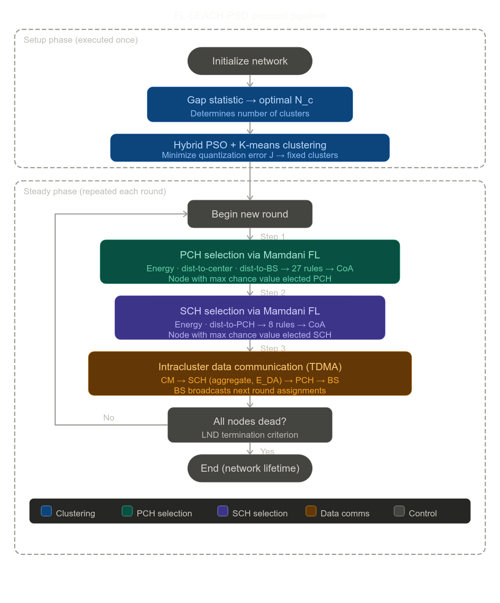

# FL-LEACH-PSO: Fuzzy Logic LEACH Technique-Based Particle Swarm Optimization

### 1. Overview and Motivation

*(Section I–II, Gamal et al., 2022)*

Wireless sensor networks (WSNs) are resource-constrained systems in which energy conservation is the primary design concern. The classical LEACH protocol addresses this via hierarchical clustering but suffers from random cluster head (CH) selection, which leads to suboptimal energy distribution and premature node death. The proposed FL-LEACH-PSO protocol resolves these limitations by replacing probabilistic CH election with a structured two-tier selection mechanism, and random cluster formation with a deterministic hybrid optimization algorithm.

---

### 2. Network and Energy Model

*(Section III, Gamal et al., 2022)*

The network consists of $N$ sensor nodes randomly deployed in a two-dimensional square area. The base station (BS) is fixed, energy-unlimited, and its position is known to all nodes. Each node is GPS-equipped and immobile post-deployment. The protocol adopts a two-tier CH hierarchy: a **Primary Cluster Head (PCH)** transmits aggregated data directly to BS, while a **Secondary Cluster Head (SCH)** collects and aggregates data from cluster members (CMs) before forwarding to PCH.

The radio energy model governs transmission and reception costs. A distance threshold $d_0$ determines which propagation model applies:

$$d_0 = \sqrt{\frac{E_{fs}}{E_{amp}}} \tag{1}$$

Transmitter energy consumption for $B$-bit data over distance $d$:

$$E_{TX}(B, d) = \begin{cases} E_{elec} \cdot B + E_{fs} \cdot B \cdot d^2, & d < d_0 \\ E_{elec} \cdot B + E_{amp} \cdot B \cdot d^4, & d \geq d_0 \end{cases} \tag{2}$$

Receiver energy consumption:

$$E_{RX} = B \cdot E_{elec} \tag{3}$$

---

### 3. Protocol Phases

*(Section IV, Gamal et al., 2022)*

The protocol operates in two phases. The **setup phase** (executed once) performs cluster formation using the hybrid PSO–K-means algorithm. The **steady phase** (repeated each round) consists of three steps: PCH selection via fuzzy logic (FL), SCH selection via FL, and intracluster data communication.

---

### 4. Cluster Formation: Hybrid PSO and K-Means

*(Section IV-A, Gamal et al., 2022)*

The optimal number of clusters $N_c$ is determined using the **Gap statistic**, which compares intracluster variation against a null reference distribution.

**K-Means step:** Sensor node $s = (s_1, s_2)$ is assigned to the nearest cluster center $c = (c_1, c_2)$ using Euclidean distance:

$$d(s, c) = \sqrt{(s_1 - c_1)^2 + (s_2 - c_2)^2} \tag{4}$$

Cluster centers are updated iteratively:

$$c = \frac{1}{n_j} \sum_{\forall S_p \in C_j} S_p \tag{5}$$

**PSO step:** Each particle represents a candidate set of $N_c$ cluster centers $\mathbf{X} = (c_1, c_2, \ldots, c_{N_c})$. Particle velocity and position are updated as:

$$v_{i,D}(t+1) = w \cdot v_{i,D}(t) + c_1 r_1 (y_{i,D}(t) - x_{i,D}(t)) + c_2 r_2 (g_i(t) - x_{i,D}(t)) \tag{6}$$

$$x_i(t+1) = x_i(t) + v_i(t+1) \tag{7}$$

where $w$ is inertia weight, $c_1, c_2$ are acceleration coefficients, $r_1, r_2 \in [0,1]$ are random scalars, $y_i$ is the personal best, and $g_i$ is the global best position.

The fitness function is the **quantization error** $J$:

$$J = \frac{\sum_{j=1}^{N_C} \left[ \sum_{\forall S_p \in C_{ij}} d(s, c_j) / |C_{ij}| \right]}{N_c} \tag{10}$$

The K-means output is used to initialize one particle; the remainder are initialized randomly, ensuring a strong starting solution while retaining global search diversity.

---

### 5. PCH Selection via Fuzzy Logic

*(Section IV-B, Gamal et al., 2022)*

Each round, every node evaluates its candidacy for PCH using a **Mamdani fuzzy inference system (FIS)** with three crisp inputs:

- **Residual energy** — $M_f \in [0, 0.5]$; linguistic levels: low, medium, high (triangular MFs)
- **Distance to cluster center** — $M_f \in [0, 140]$; levels: near, adequate, distant (trapezoidal/triangular MFs)
- **Distance to BS** — $M_f \in [0, 70]$; levels: near, adequate, distant

Maximum parameter values are normalized as:

$$\text{Max\_Energy} = \text{InitialEnergy} \tag{11}$$
$$\text{Max\_dist\_to\_BS} = \sqrt{BS_X^2 + BS_Y^2} \tag{12}$$
$$\text{Max\_dist\_to\_cluster's\_center} = \sqrt{X_m^2 + Y_m^2} \tag{13}$$

The fuzzy rule base consists of $3^3 = 27$ expert-defined if-then rules. The output variable **PCH selection chance** has nine linguistic levels (very weak → very strong), represented by triangular MFs over $[0, 100]$.

### Table 1: PCH Selection Chance

| | Energy Level | Distance To Cluster Center | Distance To BS | PCH Selection Chance |
|-|-------------|----------------------------|----------------|----------------------|
| 1            | low                        | distant        | distant              | very weak            |
| 2            | low                        | distant        | adequate           | weak                 |
| 3            | low                        | distant        | near               | little weak          |
| 4            | low                        | adequate       | distant            | weak                 |
| 5            | low                        | adequate       | adequate           | little weak          |
| 6            | low                        | adequate       | near               | little medium        |
| 7            | low                        | near           | distant            | little weak          |
| 8            | low                        | near           | adequate           | little medium        |
| 9            | low                        | near           | near               | medium               |
| 10           | medium                     | distant        | distant            | little weak          |
| 11           | medium                     | distant        | adequate           | little medium        |
| 12           | medium                     | distant        | near               | medium               |
| 13           | medium                     | adequate       | distant            | little medium        |
| 14           | medium                     | adequate       | adequate           | medium               |
| 15           | medium                     | adequate       | near               | high medium          |
| 16           | medium                     | near           | distant            | medium               |
| 17           | medium                     | near           | adequate           | high medium          |
| 18           | medium                     | near           | near               | little strong        |
| 19           | high                       | distant        | distant            | medium               |
| 20           | high                       | distant        | adequate           | high medium          |
| 21           | high                       | distant        | near               | little strong        |
| 22           | high                       | adequate       | distant            | high medium          |
| 23           | high                       | adequate       | adequate           | little strong        |
| 24           | high                       | adequate       | near               | strong               |
| 25           | high                       | near           | distant            | little strong        |
| 26           | high                       | near           | adequate           | strong               |
| 27           | high                       | near           | near               | very strong          |

Defuzzification uses the **Center of Area (CoA)** method. The node with the highest chance value in each cluster is elected PCH; ties are broken by residual energy.

---

### 6. SCH Selection via Fuzzy Logic

*(Section IV-C, Gamal et al., 2022)*

SCH selection uses a two-input Mamdani FIS:

- **Residual energy** — same MF as PCH ($M_f \in [0, 0.5]$)
- **Distance to PCH** — $M_f \in [0, 140]$; levels: near, adequate, distant

$$\text{Max\_dist\_to\_PCH} = \sqrt{X_m^2 + Y_m^2} \tag{14}$$

The rule base consists of $2^3 = 8$ rules; the output **SCH selection chance** has five levels: very low, low, medium, high, very high. Defuzzification again uses CoA. The highest-chance node per cluster is elected SCH; ties resolved by energy. SCH aggregates CM data using energy model ratio $E_{DA} = 5\ \text{nJ/bit/m}^4$ before forwarding to PCH.

### Table 2

| | Energy Level | Distance To PCH | SCH Selection Chance |
|-|-------------|-----------------|----------------------|
| 1            | low             | distant              | very low             |
| 2            | medium          | distant              | low                  |
| 3            | high            | distant              | medium               |
| 4            | low             | adequate             | low                  |
| 5            | medium          | adequate             | medium               |
| 6            | high            | adequate             | medium               |
| 7            | low             | near                 | medium               |
| 8            | medium          | near                 | high                 |
| 9            | high            | near                 | very high            |

---

### 7. Intracluster Data Communication

*(Section IV-D, Gamal et al., 2022)*

After CH selection, BS broadcasts cluster assignments including PCH and SCH IDs. Each CM selects a TDMA slot to transmit sensed data to its SCH, then sleeps. SCH aggregates received data and forwards it to PCH. PCH forwards the final aggregated packet to BS.

---

### 8. Time Complexity

*(Section IV-E, Gamal et al., 2022)*

| Operation | Complexity |
|---|---|
| Hybrid PSO + K-means clustering | $\mathcal{O}(n^2)$ |
| PCH selection by FL (27 rules) | $\mathcal{O}(n \times FL_{rules})$ |
| SCH selection by FL (8 rules) | $\mathcal{O}(n \times FL_{rules})$ |

---

### 9. Simulation Results

*(Section V, Gamal et al., 2022)*

Simulations were conducted in MATLAB across two scenarios (100 nodes / 100×100 m², and 1000 nodes / 100×100 m²). The proposed protocol was benchmarked against FCM+FLS (Rajput and Kum), LEACH-FC, and ECE-LEACH (Chen et al.).

In Scenario 1, the last node died beyond 10,000 rounds (vs. 6,851 / 2,481 / 1,764 for competitors), yielding a network lifetime improvement exceeding **46%**. Total bits transferred reached $196 \times 10^6$ at 92% lifespan — a **17.6% throughput improvement** over the next-best protocol. In Scenario 2 (1000 nodes), the proposed protocol sustained 970 surviving nodes past 10,000 rounds and transferred $1 \times 10^9$ bits at 97% lifespan, outperforming all baselines in both lifetime and throughput metrics.

### 10. Algorithm pipeline

