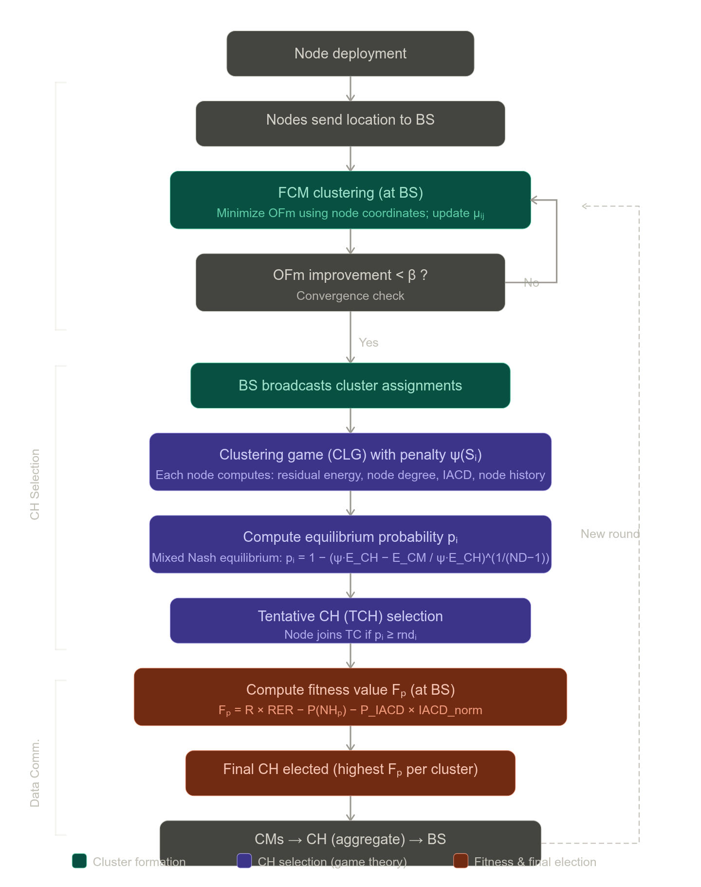

# GTFR: Game Theory-Based Fuzzy Routing Protocol for WSNs

**Paper:** Gangwar et al., "GTFR: A Game Theory-Based Fuzzy Routing Protocol for WSNs," *IEEE Sensors Journal*, Vol. 24, No. 6, March 2024.

---

## Overview

The **Game Theory-Based Fuzzy Routing (GTFR)** protocol addresses energy efficiency and cluster head (CH) selection in wireless sensor networks (WSNs). The protocol integrates two complementary mechanisms: Fuzzy C-Means (FCM) clustering for spatial cluster formation, and a game-theoretic framework employing mixed Nash equilibrium for CH selection. The protocol is structured into three sequential phases: cluster formation, CH selection, and data communication. *(Section II, p. 8974)*

---

## Phase 1 — Cluster Formation via FCM

*(Section II-A, p. 8975)*

Cluster formation is performed centrally at the base station (BS) using only the Cartesian coordinates of sensor nodes. The authors deliberately exclude parameters such as residual energy or node degree from this phase, as preliminary experiments showed that incorporating them produced uneven clusters and degraded performance. The FCM algorithm minimizes the following objective function:

$$OF_m = \sum_{i=1}^{n} \sum_{j=1}^{c} \mu_{ij}^{m} \|S_i - C_j\|^2 \tag{1}$$

where $n$ is the number of sensor nodes, $c$ is the number of clusters, $m$ is the fuzzy partition matrix exponent controlling the degree of fuzzy overlap, $S_i$ is the $i$-th sensor node, $C_j$ is the centroid of the $j$-th cluster, and $\mu_{ij}$ is the membership degree of $S_i$ in cluster $j$.

Cluster centroids are computed iteratively as:

$$C_{jx} = \frac{\sum_{i=1}^{n} x_i \mu_{ij}^m}{\sum_{i=1}^{n} \mu_{ij}^m}, \quad C_{jy} = \frac{\sum_{i=1}^{n} y_i \mu_{ij}^m}{\sum_{i=1}^{n} \mu_{ij}^m} \tag{2–3}$$

Membership values are updated according to:

$$\mu_{ij} = \frac{1}{\sum_{k=1}^{c} \left( \frac{\|S_i - C_j\|^2}{\|S_i - C_k\|^2} \right)^{\frac{1}{m-1}}} \tag{5}$$

The algorithm iterates until the improvement in $OF_m$ between consecutive rounds falls below a threshold $\beta$, or a maximum iteration count is reached. The number of clusters is fixed at 5% of the total node count, in accordance with established WSN literature. This process minimizes the intracluster communication distance (IACD), enabling low-energy intracluster data transmission.

---

## Phase 2 — CH Selection via Game Theory

*(Section II-B, pp. 8975–8977)*

### 2a. Clustering Game (CLG) Formulation

CH selection is modeled as a non-cooperative clustering game defined as CLG = (AGENT, STRAT, UTIL), where each sensor node is a player (AGENT) with two strategies: become a CH or remain a cluster member (CM). The utility function for node $S_i$ is:

$$\text{UTIL}(S_i) = \begin{cases} 0, & S_i = \text{CM}, \forall j \in \text{ND}(S_i), S_j = \text{CM} \\ \frac{1}{E_{\text{CH}}(S_i)}, & S_i = \text{CH} \\ \frac{\psi(S_i)}{E_{\text{CM}}(S_i)}, & S_i = \text{CM}, \exists j \in \text{ND}(S_i), S_j = \text{CH} \end{cases} \tag{6}$$

where $E_{\text{CH}}(S_i)$ and $E_{\text{CM}}(S_i)$ are the energy costs for acting as CH or CM, respectively, and $\psi(S_i) \in [0,1]$ is a penalty coefficient. Because $E_{\text{CH}} > E_{\text{CM}}$, nodes are incentivized to avoid the CH role; the penalty mechanism discourages well-qualified nodes from refusing it.

The penalty coefficient incorporates four normalized parameters:

$$\psi(S_i) = \alpha \frac{\text{IACD}_{\max} - \text{IACD}_{S_i}}{\text{IACD}_{\max} - \text{IACD}_{\min}} + \beta \frac{ND_{\max} - ND_{S_i}}{ND_{\max} - ND_{\min}} + \gamma \frac{E_{\max} - E_{S_i}}{E_{\max} - E_{\min}} + \delta \frac{NH_{\max} - NH_{S_i}}{NH_{\max} - NH_{\min}} \tag{7}$$

where $\alpha + \beta + \gamma + \delta = 1$, and the four terms correspond to IACD, node degree, residual energy, and node history, respectively.

### 2b. Tentative CH (TCH) Selection via Mixed Nash Equilibrium

Under mixed Nash equilibrium, each node becomes a CH with probability $p$ and remains a CM with probability $p' = 1 - p$. Equilibrium requires that the expected utilities of both strategies be equal ($\text{UTIL}_{\text{CH}} = \text{UTIL}_{\text{CM}}$), yielding the equilibrium probability:

$$p_i = 1 - \left( \frac{\psi \cdot E_{\text{CH}} - E_{\text{CM}}}{\psi \cdot E_{\text{CH}}} \right)^{\frac{1}{ND(S_i)-1}} \tag{11}$$

Each node independently generates a random number $\text{rnd}_i \in [0,1]$; node $S_i$ joins the tentative CH set $\mathcal{TC}$ if $p_i \geq \text{rnd}_i$.

### 2c. Final CH Selection via Fitness Function

For each cluster, a fitness value $F_p$ is computed for every TCH node:

$$F_p = R \times \text{RER} - P(NH_p) - P_{\text{IACD}} \times \text{IACD}_{\text{norm}} \tag{15}$$

where:
- $\text{RER} = \frac{E_{\text{current}}}{E_o} \times 100$ is the remaining energy ratio (Eq. 12),
- $NH_p = \frac{\text{No. of times acted as CH}}{\text{Total rounds}}$ is the node history probability (Eq. 13),
- $\text{IACD}_{\text{norm}}(t) = \frac{\text{IACD}(t) - \text{IACD}_{\min}}{\text{IACD}_{\max} - \text{IACD}_{\min}}$ is the normalized intracluster distance (Eq. 14),
- $R$ is a lookup reward based on RER, and $P(NH_p)$, $P_{\text{IACD}}$ are tabulated penalty values.

The node with the highest $F_p$ within each cluster is elected as the final CH for that round.

---

## Phase 3 — Data Communication

*(Section II-C, p. 8977)*

Following CH election, each CM transmits its sensed data directly to its designated CH. The CH aggregates the data and forwards the compressed result to the BS, reducing the total volume of long-range transmissions. After each data-gathering round, the entire process restarts from the cluster formation phase.

---

## Computational Complexity

*(Section II-F, p. 8977–8978)*

The FCM algorithm, executed centrally at the BS, has worst-case complexity $\mathcal{O}(\text{ITER} \times n \times c \times \text{DIM})$, which reduces to $\mathcal{O}(n^2)$ for the full centralized process. The distributed game-theoretic TCH selection runs in $\mathcal{O}(n)$. Fitness value computation at the BS for the TCH set of size $m < n$ is $\mathcal{O}(m)$. The overall framework complexity is thus $\mathcal{O}(n^2)$.

---

## Algorithm pipeline flowchart

---

## Performance Results

*(Section III, pp. 8978–8980)*

Simulations were conducted in MATLAB 2019 across three network scenarios of increasing scale (50×50 m², 100×100 m², 200×200 m²) with 100, 100, and 200 nodes respectively, benchmarked against LEACH, HSCR-LEACH, FCM, and CT-RPL. GTFR's improvement in network stability (first node death, FND) over LEACH, HSCR-LEACH, FCM, and CT-RPL is 238.27%, 183.94%, 432.04%, and 47.31%, respectively, averaged across scenarios. Energy consumption results further demonstrate that GTFR's advantage scales with network size — in the largest scenario (200×200 m²), GTFR consumed only 81.85% of initial energy after 500 rounds, compared to 91.51% for CT-RPL, indicating that the protocol is particularly well-suited to large-scale deployments. *(Section III-B/C, pp. 8978–8980)*