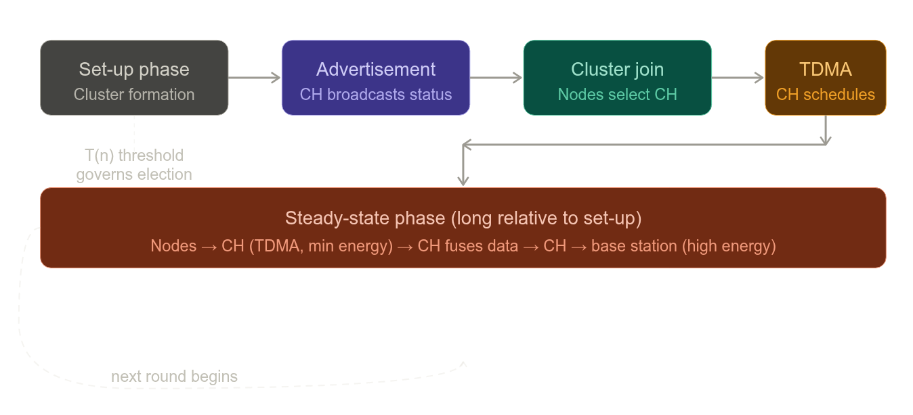

# Summary: LEACH — Low-Energy Adaptive Clustering Hierarchy

---

## 1. Problem Context and Motivation

LEACH was developed in response to the inadequacy of conventional routing protocols for wireless microsensor networks, where all nodes are homogeneous, energy-constrained, and must eventually deliver data to a fixed, distant base station. The paper examines three conventional approaches — direct transmission, minimum-transmission-energy (MTE) routing, and static clustering — and identifies critical limitations in each.

Under direct transmission, each node transmits data over the full distance *d* to the base station, incurring high amplifier energy costs proportional to *d²*. In MTE routing, data is relayed through intermediate nodes to reduce per-hop transmit distance, but at the cost of additional receive operations at each intermediate node. For a message of *k* bits traversing *n* hops of distance *r*, the total energies are:

$$E_{\text{direct}} = k(E_{\text{elec}} + \varepsilon_{\text{amp}} n^2 r^2)$$

$$E_{\text{MTE}} = k((2n - 1)E_{\text{elec}} + \varepsilon_{\text{amp}} n r^2)$$

Direct transmission is more efficient when:

$$\frac{E_{\text{elec}}}{\varepsilon_{\text{amp}}} > \frac{r^2 n}{2}$$

meaning MTE's advantage disappears when electronics energy dominates or transmission distances are short. More critically, MTE routing creates a "hotspot" problem: nodes nearest the base station are disproportionately burdened as routers for distant nodes, causing them to fail first and triggering a cascading network collapse. Static clustering avoids this problem partially but assumes cluster-heads are high-energy, permanent nodes — an assumption that fails in all-homogeneous networks where any fixed cluster-head will deplete rapidly.

---

## 2. LEACH Protocol Design

LEACH addresses these issues through three core mechanisms: randomized cluster-head rotation, localized cluster coordination, and in-network data fusion.

### 2.1 Cluster-Head Election

Each round, a node *n* draws a random number between 0 and 1 and becomes a cluster-head if that number falls below a threshold *T(n)*:

$$T(n) = \begin{cases} \dfrac{P}{1 - P \cdot \left(r \bmod \frac{1}{P}\right)} & \text{if } n \in G \\ 0 & \text{otherwise} \end{cases}$$

where *P* is the desired fraction of cluster-heads (empirically optimized at approximately 5%), *r* is the current round number, and *G* is the set of nodes that have not served as cluster-head in the last *1/P* rounds. This mechanism ensures that every node becomes a cluster-head exactly once per *1/P*-round cycle, distributing the energy burden uniformly across the network.

### 2.2 Advertisement and Cluster Formation

Once elected, cluster-heads broadcast their status using a CSMA MAC protocol at uniform transmit power. Non-cluster-head nodes select the cluster-head whose advertisement arrives with the greatest signal strength — a proxy for minimum communication energy, assuming symmetric channel propagation — and transmit their membership notification back to that cluster-head.

### 2.3 TDMA Scheduling

The cluster-head assigns each member a dedicated transmission slot via a TDMA schedule, allowing non-cluster-head nodes to power down their radios outside their allocated window, significantly reducing idle-listening energy.

### 2.4 Data Aggregation and Transmission

During steady-state operation, member nodes transmit their sensed data to the cluster-head during their TDMA slot using the minimum energy required to reach the cluster-head. The cluster-head then performs signal fusion (e.g., beamforming for acoustic or seismic signals) to compress the data into a single aggregate signal, which is transmitted to the base station over the long-haul high-energy link. Since only a small fraction of nodes serve as cluster-heads at any time, this expensive transmission is confined to a limited number of nodes per round.

### 2.5 Interference Mitigation

Because radio is a broadcast medium, transmissions across neighboring clusters interfere. LEACH assigns each cluster a distinct CDMA spreading code chosen randomly at cluster formation, so cluster-heads can filter out energy from other clusters.

### 2.6 Operational Phases per Round

Each LEACH round consists of:

1. **Set-up phase** — cluster formation via the *T(n)* threshold election
2. **Advertisement phase** — cluster-heads broadcast status (CSMA MAC)
3. **Cluster join phase** — non-cluster-head nodes select their cluster-head
4. **TDMA schedule creation** — cluster-head assigns transmission slots
5. **Steady-state phase** — data flows from nodes → cluster-head → base station (long relative to set-up to minimize overhead)

---

## 3. Optimal Cluster-Head Fraction

An optimal cluster-head percentage *N̂* exists. Too few cluster-heads force distant nodes to transmit over long ranges to reach their cluster-head; too many cluster-heads reduce local compression while increasing the number of nodes bearing long-haul transmission costs to the base station. For the simulated 100-node random network with the given radio parameters and a computation cost of 5 nJ/bit/message, *N̂ = 5%*.

---

## 4. Radio Energy Model

The analysis is grounded in a first-order radio model where transmitting a *k*-bit message over distance *d* dissipates:

$$E_{Tx}(k,d) = E_{\text{elec}} \cdot k + \varepsilon_{\text{amp}} \cdot k \cdot d^2$$

and receiving the same message dissipates:

$$E_{Rx}(k) = E_{\text{elec}} \cdot k$$

with *E_elec* = 50 nJ/bit for transceiver electronics and *ε_amp* = 100 pJ/bit/m² for the transmit amplifier. The quadratic dependence on distance underpins why cluster-based communication is beneficial when most nodes are close to their cluster-head.

---

## 5. Performance Results

Simulation results on a 100-node random network demonstrate substantial improvements over all baseline protocols.

**Energy dissipation.** LEACH achieves a 7–8× reduction in total system energy relative to direct transmission and a 4–8× reduction relative to MTE routing, primarily due to local data fusion and short intra-cluster transmission distances.

**System lifetime.** LEACH more than doubles useful system lifetime compared to direct transmission, MTE routing, and static clustering. The first node death in LEACH occurs approximately 8× later than in any of the other protocols, and the last node death approximately 3× later.

**Spatial fairness.** Because cluster-head rotation distributes energy load uniformly, nodes in LEACH deplete in an approximately random spatial pattern rather than concentrating failures near the base station (as in MTE routing) or far from it (as in direct transmission). This prevents any region of the deployment area from losing sensing coverage disproportionately early.

---

## 6. Extensions and Limitations

LEACH is fully distributed and requires no global network knowledge or control from the base station. The authors acknowledge that the MATLAB simulations do not account for cluster set-up overhead or routing start-up costs. They propose extending LEACH to a hierarchical multi-tier architecture, in which cluster-heads communicate with super-cluster-heads, reducing energy for large-scale deployments. Future work is also noted for incorporating energy-heterogeneous node support and validating results using the ns network simulator.

---