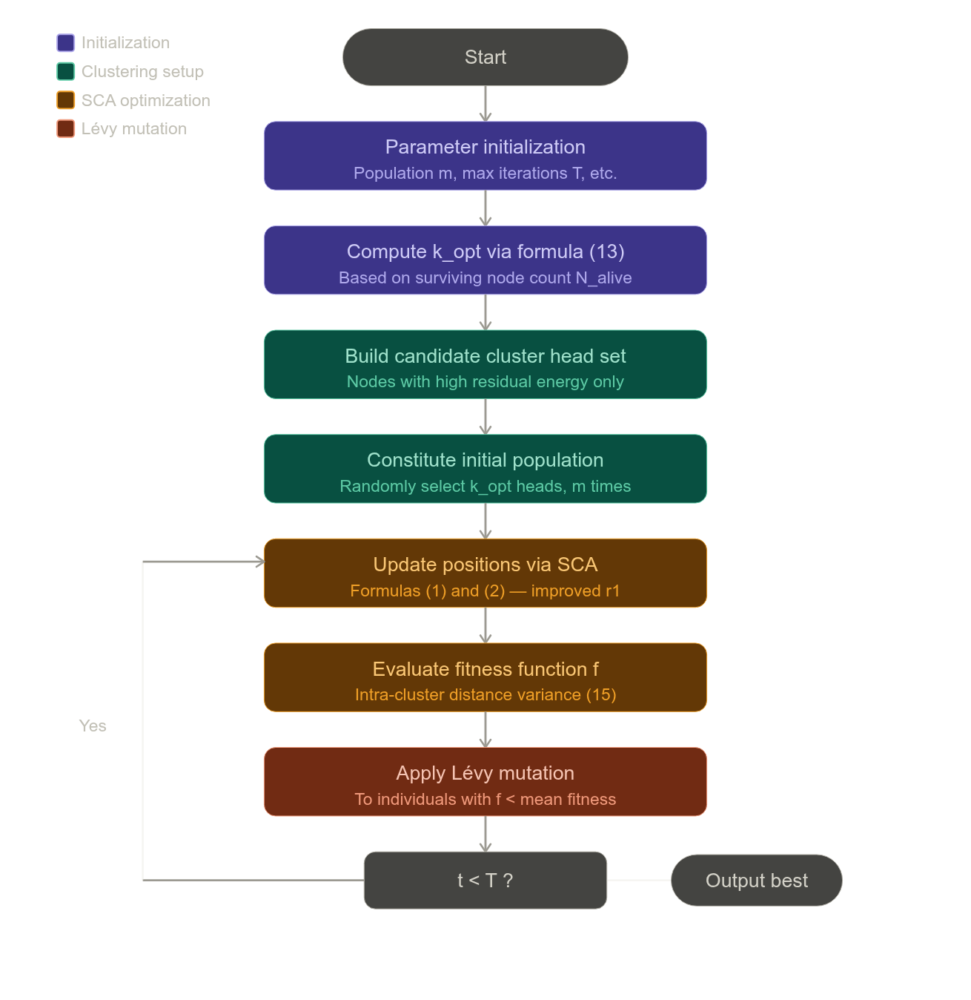

# SCA-Lévy Clustering Routing Algorithm — Summary

> Guo, X., Ye, Y., Li, L., Wu, R., & Sun, X. (2023). WSN Clustering Routing Algorithm Combining Sine Cosine Algorithm and Lévy Mutation. *IEEE Access*, 11, 22654–22663. DOI: 10.1109/ACCESS.2023.3252027

---

## Overview

The paper proposes a centralized WSN clustering routing algorithm — referred to as the **SCA-Lévy Clustering Routing Algorithm** — that addresses the twin problems of short network lifespan and unbalanced energy consumption among sensor nodes. The algorithm fuses an improved Sine Cosine Algorithm (SCA) with Lévy mutation to select optimal cluster heads per round, and introduces a relay node scheme for energy-efficient inter-cluster data forwarding. (Source: Abstract and Section I)

---

## 1. Network and Energy Models

The monitoring field is assumed to be an M×M area with the base station (BS) located above it. Node positions are initialized using the **Tent chaotic map** to achieve uniform spatial distribution (Section V-A):

$$x^{i+1} = \begin{cases} 2x^i, & x^i \in [0, 0.5] \\ 2(1 - x^i), & x^i \in (0.5, 1] \end{cases}$$

$$z = x^{i+1}(ub - lb) + lb$$

The standard first-order radio energy model is adopted. Transmission energy cost depends on distance relative to a threshold $d_0 = \sqrt{\varepsilon_{fs}/\varepsilon_{mp}} \approx 87$ m (Section V-B):

$$E_{TX}(l, d) = \begin{cases} lE_{elec} + l\varepsilon_{fs}d^2, & d < d_0 \\ lE_{elec} + l\varepsilon_{mp}d^4, & d \geq d_0 \end{cases}$$

$$E_{Rx}(l) = lE_{elec}, \quad E_{Fx}(n, l) = nlE_{DA}$$

where $E_{DA} = 5$ nJ/bit/signal is the data aggregation cost per node.

---

## 2. Sine Cosine Algorithm with Improved Step Size

The standard SCA updates candidate solution positions using sine and cosine trigonometric operators (Section III):

$$X_i^{t+1} = \begin{cases} X_i^t + r_1 \times \sin(r_2) \times |r_3 P_i^t - X_i^t|, & r_4 < 0.5 \\ X_i^t + r_1 \times \cos(r_2) \times |r_3 P_i^t - X_i^t|, & r_4 \geq 0.5 \end{cases}$$

Here $P_i^t$ is the current global best position, $r_2 \in [0, 2\pi]$, $r_3 \in [0, 2]$, and $r_4 \in [0, 1]$. In the standard SCA, the search step factor $r_1 = a(1 - t/T)$ decreases linearly from 2 to 0, which causes premature convergence in later iterations. The paper replaces this with a sinusoidal decay (Section III):

$$r_1 = a\sin\!\left(\frac{\pi}{2}\left(1 - \frac{t}{T}\right)\right) + b, \quad a = 2,\ b = 0.5$$

This confines $r_1 \in [0.5, 2.5]$, giving a broader exploration range $[-2.5, 2.5]$ for the update term, and a slower rate of decrease that better sustains global search capability across iterations.

---

## 3. Lévy Mutation

Lévy flight is a heavy-tailed random walk in which large jumps occur with relatively high probability, making it well-suited for escaping local optima (Section IV). The Lévy distribution is modeled as:

$$L(s) \sim |s|^{-1-\beta}$$

Random steps are generated via the Mantegna algorithm:

$$s = \frac{u}{|v|^{1/\beta}}, \quad u \sim \mathcal{N}(0, \sigma_u^2),\ v \sim \mathcal{N}(0, \sigma_v^2)$$

$$\sigma_u = \left(\frac{\Gamma(1+\beta)\sin(\pi\beta/2)}{\Gamma[(1+\beta)/2]\beta 2^{(\beta-1)/2}}\right)^{1/\beta},\quad \sigma_v = 1,\quad \beta = 1.5$$

Lévy mutation is selectively applied to individuals whose fitness values fall below the population average, increasing diversity without degrading the best solutions:

$$X_{ij}(t+1) = X_{ij}(t) + L(s) \times \left|X_j^*(t) - X_{ij}(t)\right|$$

where $X_j^*(t)$ is the current global best position.

---

## 4. Dynamic Cluster Head Count

Rather than using a fixed cluster head ratio, the algorithm dynamically computes $k_{opt}$ based on currently surviving nodes (Section V-C):

$$k_{opt} = \text{round}(N_{alive} \times p) = \text{round}[(N - D_{dead}) \times p]$$

This prevents over-clustering as node mortality increases, thereby maintaining a balanced communication load per round. In each round, BS computes average residual energy and forms a candidate cluster head set from high-energy nodes; $k_{opt}$ heads are randomly drawn from this set $m$ times to initialize the population.

---

## 5. Fitness Function

The fitness function penalizes non-uniformity in intra-cluster distance distribution (Section V-D). Let $d_{toCH}(i)$ be the distance from member node $i$ to its cluster head, and let $D$ be the total sum of squared intra-cluster distances across all $k_{opt}$ clusters:

$$D = \sum_{i=1}^n d_{toCH}^2(i) + \sum_{i=1}^m d_{toCH}^2(i) + \cdots + \sum_{i=1}^q d_{toCH}^2(i), \quad n + m + \cdots + q = N_{alive} - k_{opt}$$

The fitness function measures the deviation of each cluster's distance sum from the global mean:

$$f = \left|\sum_{i=1}^n d_{toCH}^2(i) - \frac{1}{k_{opt}} D\right| + \left|\sum_{i=1}^m d_{toCH}^2(i) - \frac{1}{k_{opt}} D\right| + \cdots + \left|\sum_{i=1}^q d_{toCH}^2(i) - \frac{1}{k_{opt}} D\right|$$

Minimizing $f$ encourages evenly-sized clusters with compact member-to-head distances, reducing per-round communication energy.

---

## 6. Relay Node Design

To avoid costly long-distance transmissions from cluster heads to BS, the algorithm introduces relay nodes during the data forwarding phase (Section V-F). A node qualifies as a relay node (RN) if it satisfies:

$$RN = \begin{cases} E_{RN} > 0 \cap d_{CH-RN}^2 + d_{RN-BS}^2 < d_{CH-BS}^2 \\ d_{CH-RN} < \frac{1}{\sqrt{2}} d_{CH-BS} \\ d_{RN-BS} < \frac{1}{\sqrt{2}} d_{CH-BS} \\ \max\!\left(E_i / (d_{CH-RN}^2 + d_{RN-BS}^2)\right) \end{cases}$$

The geometric constraint ensures the relay lies within a circle of diameter $d_{CH-BS}$, where any point on or within the circle satisfies the triangle-based energy saving condition. The final selection maximizes the ratio of residual energy to total squared hop distance, jointly balancing energy and proximity.

---

## 7. Algorithm Pipeline (Cluster Head Election)

The cluster head election process follows these steps (Section V-E, Figure 5):

1. **Parameter initialization:** Set population number $m$, maximum iteration count $T$, and other parameters.
2. **Compute $k_{opt}$:** Calculate the number of cluster heads for this round using formula (13), based on surviving node count $N_{alive}$.
3. **Build candidate set:** Select nodes with high residual energy to form the candidate cluster head collection.
4. **Constitute initial population:** Randomly select $k_{opt}$ cluster heads from the candidate set, repeated $m$ times.
5. **Update positions via SCA:** Apply formulas (1) and (2) with the improved step size $r_1$ to update individual positions.
6. **Evaluate fitness function $f$:** Compute intra-cluster distance variance for all individuals using formula (15).
7. **Apply Lévy mutation:** For individuals whose fitness $f$ falls below the population mean, apply Lévy mutation via formula (7) to increase population diversity.
8. **Record best individual:** Store the individual grouping with the lowest $f$.
9. **Repeat steps 5–8** until $t = T$. Output the globally best cluster head grouping.

---

## 8. Full Algorithm Operation

Each round of the SCA-Lévy algorithm proceeds in two phases (Section V):

**Cluster head election phase:** The BS runs the population-based optimization loop. The population of $m$ candidate cluster head groupings is iteratively updated using the improved SCA position update. After each iteration, individuals below average fitness undergo Lévy mutation to enhance population diversity. After $T$ iterations, the grouping with the globally minimum $f$ is selected as the cluster head scheme for that round. Non-head nodes join their nearest cluster head.

**Data transmission phase:** Member nodes sense and transmit data to their cluster head. The cluster head performs local data aggregation. If the cluster head-to-BS distance exceeds $d_0$, the relay node algorithm selects an intermediate forwarding node according to the energy-distance criterion in formula (16); otherwise, direct transmission is used.

---

## 9. Simulation Results

Experiments were conducted in MATLAB on a 200×200 m field with 200 nodes, each carrying 0.5 J initial energy, with the BS at (100, 250) (Section VI, Table 1). The SCA-Lévy algorithm is benchmarked against LEACH, LEACH-C, CRISCA, and LEACH-SCA.

**Network lifetime (Table 2):** The first node death in SCA-Lévy occurs at round 925, compared to LEACH (303), LEACH-C (398), CRISCA (487), and LEACH-SCA (782). Crucially, 80% node mortality is reached at round 949 — only 24 rounds after the first death — indicating highly balanced energy consumption with minimal premature node isolation.

**Energy consumption:** Per-round energy expenditure in SCA-Lévy averages approximately 0.105 J, the lowest among all compared algorithms, and remains near-constant before any node death. Other algorithms exhibit high inter-round variance (Section VI-C).

**Throughput:** SCA-Lévy delivers the greatest cumulative number of packets to the BS, owing to its lower per-round communication cost and extended network life. Cumulative packets reach approximately 188,619 in the 200×200 scenario, the highest across all algorithms (Section VI-E, Figure 14).

**Applicability (Table 3):** Across different deployment areas (100×100 to 400×400 m) and node counts, SCA-Lévy consistently outperforms competitors in first-node lifetime, with its advantage widening as the field size increases. In a 300×300 field, LEACH's first node dies at round 81 versus SCA-Lévy's round 669.

---

## 10. Limitations

The authors note that the relay node design has geometric constraints tied to field size, node density, and BS position. As the area or node count continue to increase significantly, the algorithm's performance gain in network life cycle becomes limited. Future work is directed toward multi-hop inter-cluster routing and multi-hop relay chains for larger-scale deployments (Section VII).