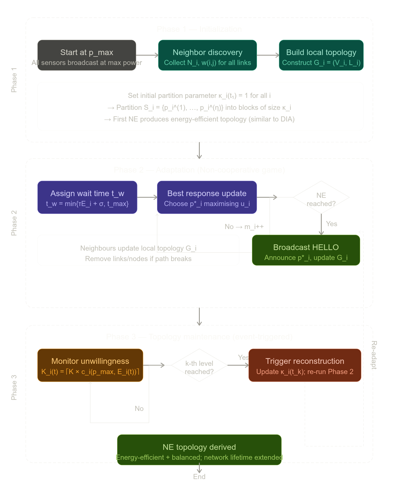

# TCLE: Topology Control with Lifetime Extension — Methodology Summary

## 1. Problem Formulation and System Model

*(Section III, Xu et al., 2016)*

The paper considers a wireless sensor network modeled as an undirected graph $G(t) = (\mathcal{V}, \mathcal{L}(t))$, where $\mathcal{V}$ is the sensor set and $\mathcal{L}(t)$ is the time-varying link set. A bidirectional link $l_{ij}$ exists between sensors $i$ and $j$ if and only if both satisfy the received power threshold condition:

$$\min\{p_i, p_j\} \geq p^{th}/G_{ij}$$

where $p_i$ is the transmit power of sensor $i$, $p^{th}$ is the signal capture threshold, and $G_{ij} = Cd_{ij}^{-\alpha}$ is the propagation factor (free-space model). The minimum power required to maintain a link is defined as $w(i,j) = p^{th}/G_{ij}$. Network lifetime is defined as the time until the first sensor depletes its battery.

## 2. Game-Theoretic Formulation

*(Section IV, Xu et al., 2016)*

The topology control problem is cast as a non-cooperative game $\Gamma = \langle \mathcal{V}, \mathcal{S}, \{u_i\} \rangle$, where each sensor $i$ is a player choosing a transmit power $p_i(t) \in S_i = [0, p_i^{max}]$ as its strategy. The central concept is the **unwillingness function**, which quantifies how reluctant a sensor is to expend energy:

$$c_i(p_i(t), E_i(t)) = \frac{1}{M_i} \int_{E_i^0 - E_i(t)}^{E_i^0 - E_i(t) + p_i(t)T} f_i(x)\,dx$$

where $E_i^0$ is initial battery energy, $E_i(t)$ is residual energy, $T$ is the unit transmission time, $M_i$ is a normalization constant, and $f_i(x)$ is an increasing **pricing function** (linear, quadratic, or exponential). This function is increasing in $p_i$ and decreasing in $E_i$, capturing the intuition that sensors with low residual energy are especially reluctant to expend power. The utility of sensor $i$ is then defined as:

$$u_i(\mathbf{p}(t)) = \varphi_i(\mathcal{G}_{\mathbf{p}(t)}) - c_i(p_i(t), E_i(t))$$

where the benefit $\varphi_i(\mathcal{G}_{\mathbf{p}(t)}) = h_\Lambda(\mathbf{p}(t))$ is an indicator function equal to 1 if the algebraic connectivity $a(\mathcal{G}_{\mathbf{p}(t)}) > \epsilon$ (the network is sufficiently connected) and 0 otherwise. The parameter $\epsilon$ controls the desired degree of connectivity redundancy.

## 3. Theoretical Analysis: Nash Equilibrium and Pareto Optimality

*(Section IV, Xu et al., 2016)*

The paper proves that $\Gamma$ is an **Ordinal Potential Game (OPG)** with potential function:

$$V(\mathbf{p}(t)) = h_\Lambda(\mathbf{p}(t)) - \frac{1}{M}\sum_{i=1}^{n}\int_{E_i^0-E_i(t)}^{E_i^0-E_i(t)+p_i(t)T} f_i(x)\,dx$$

where $M = \max\{M_1, \ldots, M_n\}$. Because OPGs with compact strategy spaces always possess at least one Nash Equilibrium (NE), the existence of NE is guaranteed. Furthermore, it is proved that any NE $\mathbf{p}^*$ over a connected topology $\mathcal{G}_{\mathbf{p}^*}$ is **Pareto optimal**: no sensor can reduce its unwillingness further without disconnecting the network. The proof proceeds by contradiction — any improvement for one sensor would require reducing its power below the threshold needed to maintain connectivity, which contradicts the NE condition.

## 4. The TCLE Algorithm

*(Section V, Xu et al., 2016)*

The TCLE algorithm operates in three sequential phases:

**Phase 1 — Initialization.** Each sensor $i$ broadcasts at maximum power $p_i^{max}$, discovers its neighbor set $\mathcal{N}_i$, and constructs its local topology $\mathcal{G}_i = (\mathcal{V}_i, \mathcal{L}_i)$ where $\mathcal{V}_i = \mathcal{N}_i \cup \{i\}$. It also records the minimum transmit power $w(j,k)$ for each link in $\mathcal{L}_i$.

**Phase 2 — Adaptation (Non-Cooperative Game).** Each sensor iteratively adjusts its power downward, selecting the best response from a partition of its strategy set. The strategy set $S_i$ is discretized into a descending sequence $\{p_i^{(1)}, \ldots, p_i^{(\eta)}\}$, where $p_i^{(1)} = p_i^{max}$ (highest) and $p_i^{(\eta)} = 0$ (lowest), and $\eta = \lfloor p_i^{max}/\delta \rfloor + 1$ is the total number of discrete levels. Then, the strategy set is partitioned into blocks:

$$\mathcal{P}_i(\kappa_i) = \{\{p_i^{(1)}, \ldots, p_i^{(\kappa_i)}\}, \{p_i^{(\kappa_i+1)}, \ldots, p_i^{(2\kappa_i)}\}, \ldots\}$$

where $\kappa_i$ is inversely proportional to the residual energy $E_i$ — sensors with lower energy have smaller $\kappa_i$, so more power levels are available to them per iteration, enabling finer-grained power reduction. A wait time function enforces update priority for energy-depleted sensors:

$$t_w = \min\{\tau E_i + \sigma, t_{max}\}$$

where $\tau$ is a unit time constant and $\sigma$ is a random perturbation for tie-breaking. Sensors with less energy wait less and thus move first (the "first-mover advantage"). An NE is declared when no further power reduction is possible without disconnecting the local topology $\mathcal{G}_i$ (i.e., $\lambda_2(\mathcal{G}_i) > \epsilon$).

**Phase 3 — Topology Maintenance.** The network topology is reconfigured using an event-triggered mechanism. Each sensor's unwillingness is divided into $K$ equal levels. When any sensor's unwillingness first reaches the $k$-th level, it broadcasts a reconstruction message and all sensors re-run Algorithm 1 with updated $\kappa_i(t_k)$:

$$\kappa_i(t_k) = K_i(t_k) = \lceil K \times c_i(p_i^{max}, E_i(t_k)) \rceil$$

This limits the total number of topology reconstructions to $K$ over the network lifetime, regardless of the number of sensors — a significant reduction compared to schemes that trigger reconstruction per-sensor, which require $K \times n$ reconstructions.

**Algorithm 1: Power Adaptation at Sensor i**

```
================================================================================
ALGORITHM 1: Power Adaptation at Sensor i
================================================================================
INPUT  : - Local topology Gi
         - Minimum transmit power w(j,k) for all links ljk in Li
         - Residual energy Ei
         - Partition Pi(κi) of strategy set Si
OUTPUT : - Optimal transmit power p*i

--------------------------------------------------------------------------------
INITIALIZATION
--------------------------------------------------------------------------------
  SET   counter mi = 1
  SET   p*i = p_max_i  (first element of partition block Pmi_i(κi))

--------------------------------------------------------------------------------
MAIN LOOP: repeat until p*i is a Nash Equilibrium
--------------------------------------------------------------------------------
  WHILE p*i is NOT a Nash Equilibrium DO

    STEP 1 — Check turn order
    │
    ├── IF mi <= mj for ALL neighbors j in Ni THEN
    │       SET wait time:
    │           tw = min( τ·Ei + σ, t_max )
    │
    │       where:
    │           τ     = constant unit time
    │           σ     = random time perturbation
    │           t_max = maximum allowed wait time
    │
    │       [NOTE: sensors with LOW residual energy get SHORTER wait time,
    │              so they update their power FIRST — "first-mover advantage"]
    │
    └── END IF

    STEP 2 — Check for neighbor updates
    │
    ├── IF no HELLO message received from any neighbor j in Ni
    │   within wait time tw THEN
    │
    │       SELECT optimal power from current power + next partition block:
    │
    │           p*i = argmax  ui(pi, p-i)
    │                pi ∈ {p*i} ∪ P(mi+1)_i(κi)
    │
    │       [NOTE: sensor picks power that MAXIMIZES its utility
    │              from its current power and the (mi+1)-th block]
    │
    │       IF p*i is NOT a Nash Equilibrium THEN
    │           INCREMENT counter:  mi = mi + 1
    │       END IF
    │
    ├── ELSE (a HELLO message WAS received from neighbor j)
    │
    │       CALL update(Gi)
    │       [update local topology based on neighbor's new power setting]
    │
    └── END IF

    STEP 3 — Check Nash Equilibrium status
    │
    ├── IF p*i IS a Nash Equilibrium THEN
    │       SET mi = ∞
    │       [signals to neighbors that sensor i is done updating,
    │        allowing them to continue their own updates]
    └── END IF

    STEP 4 — Broadcast update
        BROADCAST a HELLO message at p_max_i containing:
            - new power setting  p*i
            - new counter value  mi

  END WHILE

--------------------------------------------------------------------------------
RETURN p*i
--------------------------------------------------------------------------------
COMPLEXITY: O(η · |Ni|²)
    where η = number of discrete power levels
          |Ni| = number of neighbors of sensor i
================================================================================
```

---

**Algorithm 2: update(Gi)**

```
================================================================================
ALGORITHM 2: update(Gi) — Local Topology Update at Sensor i
================================================================================
TRIGGER: Upon receiving a HELLO message from neighbor j in Ni
         containing j's new power setting p*j

--------------------------------------------------------------------------------
MAIN LOGIC
--------------------------------------------------------------------------------

  STEP 1 — Check if neighbor j is still reachable via local topology
  │
  ├── IF there EXISTS a path from sensor i to sensor j
  │   in which ALL intermediate nodes are sensor i's neighbors THEN
  │
  │       UPDATE Li:
  │           - Remove link lij if min{p*i, p*j} < w(i,j)
  │             (i.e., j's new power can no longer support the link)
  │           - Keep link lij if min{p*i, p*j} >= w(i,j)
  │
  │       [RESULT: local topology Gi is updated to reflect
  │                j's new power setting, links may be added or removed]
  │
  ├── ELSE (path to j passes through a node k where k ∈ Nj but k ∉ Ni)
  │
  │       REMOVE neighbor j from Vi
  │       REMOVE all links associated with j from Li
  │
  │       [REASON: sensor i cannot fully observe the path to j,
  │                so j is excluded to prevent incorrect connectivity
  │                assumptions in future power adaptation steps]
  │
  └── END IF

--------------------------------------------------------------------------------
RETURN updated Gi
================================================================================
```

---

**Relationship Between the Two Algorithms**

```
  Algorithm 1 (Power Adaptation)
  │
  ├── calls ──► Algorithm 2 (update Gi)
  │               whenever a HELLO is received from a neighbor
  │
  ├── Algorithm 2 updates the local topology Gi
  │
  └── Algorithm 1 uses the updated Gi to re-evaluate
      Nash Equilibrium status and select next power level
```

## 5. Convergence and Complexity

*(Section V, Xu et al., 2016)*

The paper proves that TCLE maintains global connectivity whenever the maximum-power network $\mathcal{G}_{max}$ is connected (Theorem 3), and that its total information overhead is $O(n)$ (Theorem 4), since each sensor exchanges at most a constant $\eta$ messages per phase and the sensor density is fixed.

## 6. Simulation Results

*(Section VI, Xu et al., 2016)*

The TCLE algorithm was evaluated against DIA and EWTC in a 500×500 m² deployment of 60 sensors with initial battery energy of 50 J. The quadratic pricing function $f(x) = x^2$ was selected as a balance between energy efficiency and energy balance. Key findings include: (1) an optimal connectivity parameter $\epsilon$ exists that maximizes network lifetime; (2) when minimum energy routing is used, TCLE extends network lifetime by more than 25% compared to EWTC; and (3) when minimum hop routing is used, the improvement exceeds 60%. TCLE achieves this by driving energy-depleted sensors to low transmit power levels — even isolating them as leaf nodes — rather than increasing their connectivity as EWTC does.

## Algorithmic pipeline of TCLE:



## Implementation w.r.t docs

**Verdict:** Yes, it matches the methodology's intent — with one geometric difference.

My change makes the candidate set for each step the $\kappa$ power levels immediately below the current power, and the search repeats until no node can reduce further without dropping $\lambda_2 \le \varepsilon$ (the NE). Lining that up against the doc:

| Algorithm 1 (doc) | My fix | Match? |
| --- | --- | --- |
| Candidate set = {current} $\cup$ next $\kappa$-block (STEP 2) | {current} (via `best_power=sensor.power` init) $\cup$ next $\kappa$ lower levels | ✅ same concept |
| $\text{argmax } u_i$ over that set | `_adapt` tracks `best_util` over the block, keeps current if nothing beats it | ✅ |
| Repeat "until $p^*_i$ is a Nash Equilibrium" (STEP 3, line 82) | outer loop until a pass makes no move | ✅ |
| Wait-time order, low-energy first (STEP 1, lines 86–96) | `adapt_order` sorted by $\tau \cdot e_{\text{res}}$ + rand | ✅ |
| Walk down through successive blocks as $m_i$ increments (line 114) | window slides down as current power drops | ✅ same outcome |

---

So the essential mechanism — consider the current power plus the next $\kappa$-sized chunk of lower levels, take the utility-max, and keep descending through the partition until the connectivity floor — is exactly what the fix implements, and it's what the original code violated (it was frozen in the block containing the current power, never advancing $m_i$).

### The one difference, and why the fix is arguably the better reading

The doc's blocks are fixed-aligned (boundaries at $0, \kappa, 2\kappa, \dots$) advanced by the counter $m_i$; my version uses a **sliding window** relative to the current power. They coincide when a node sits on a block boundary and only differ in jump alignment otherwise — both converge to the same NE.

But note a quirk in the literal fixed-block reading:

* At $m_i=1$, the current power is $p^{(1)}$ (index 0) and STEP 2 only offers $\{\text{index } 0\} \cup \text{block } 2$ (indices $\kappa \dots 2\kappa-1$) — **it skips block 1's interior** (indices $1 \dots \kappa-1$).
* If a node's true connectivity floor lies inside block 1, every option in block 2 breaks connectivity ($\phi=0$), so the $\text{argmax}$ keeps it at $p_{\max}$ — i.e., it can halt above the real floor.

That would contradict the Pareto-optimality the paper proves in §3 (line 35: *"no sensor can reduce its power further without disconnecting"*). The sliding window has no such gap: it inspects every level as it descends, so it reaches the genuine NE/Pareto point.

> **Conclusion:** The fix is faithful to the paper's NE/Pareto definition even where it diverges from a byte-literal transcription of the block-counter loop.